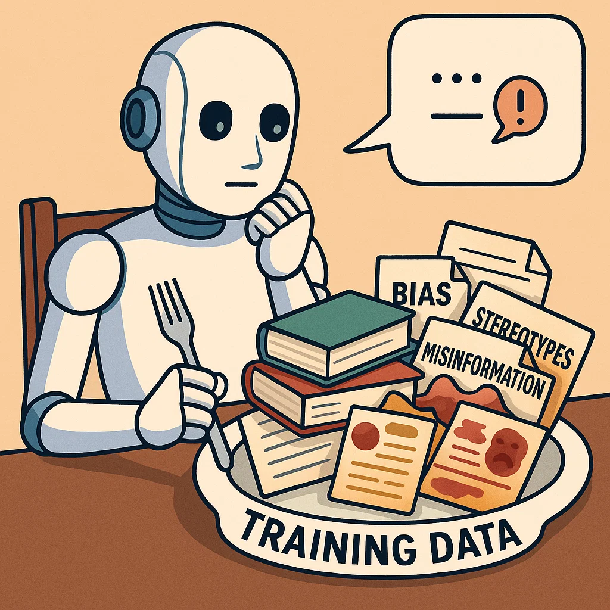

## Definition
Backpropagation is the efficient method for calculating gradients across all parameters of a deep neural network. It's a backward pass that determines how each parameter affects the final output. Backpropagation works by figuring out which adjustment of which parameter (weight/bias) in the complex neural network led to the current score, and therefore, how much and in what direction each parameter should be adjusted to improve performance in the next iteration.