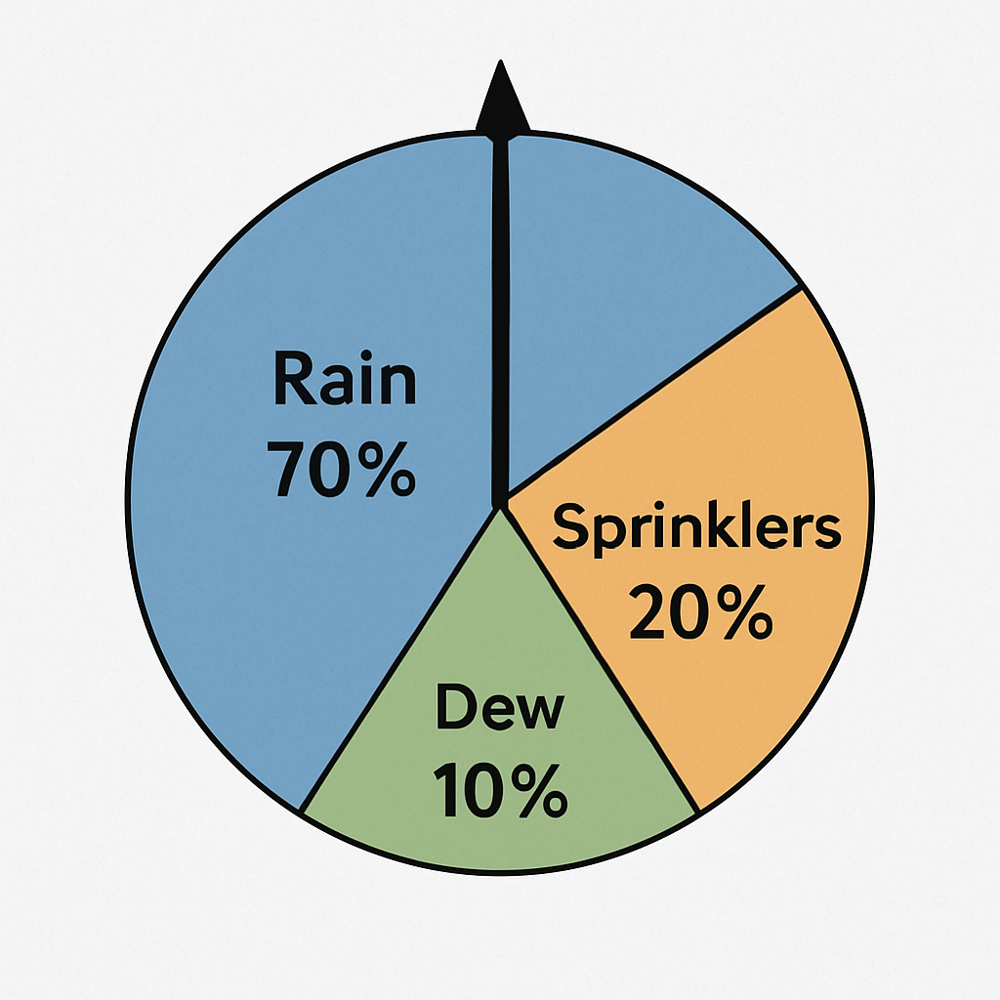

## Definition
In a Neural Network, a gradient for a specific parameter tells you how much the target (quality) score would change if that parameter were to change just a tiny bit, and in which direction (increase or decrease). Gradients are fundamental to the training process, as they indicate how to adjust the model's parameters to improve performance.