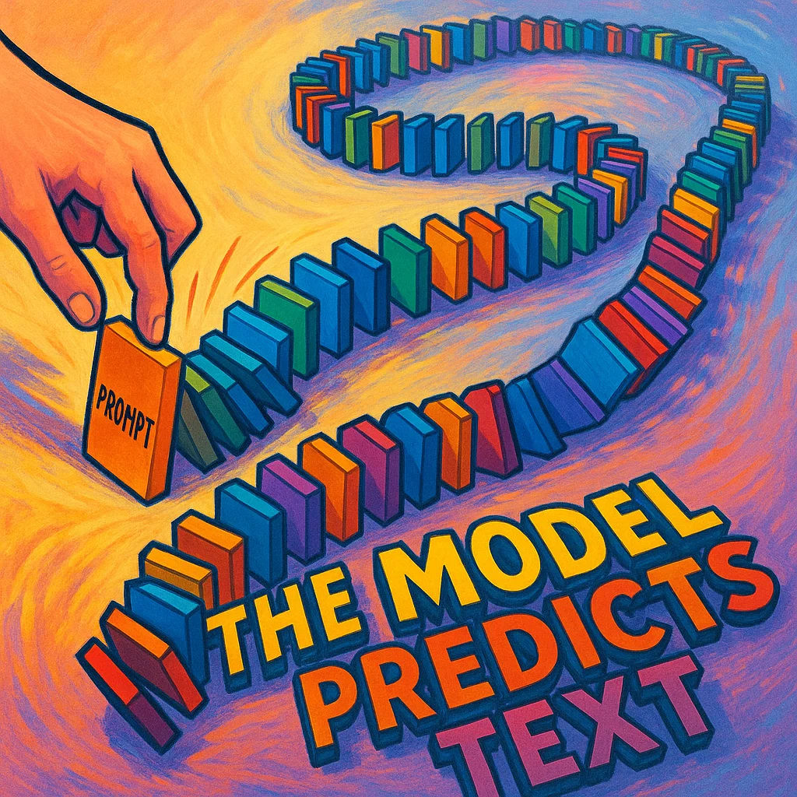

## Definition
Greedy Decoding is a text generation strategy in which an LLM always selects the single most probable next token at each step of the generation process. Unlike sampling methods that introduce variety, greedy decoding is deterministic and will always produce the same output for a given input. While efficient, this approach can sometimes lead to repetitive or less creative text generations compared to methods that incorporate some randomness.