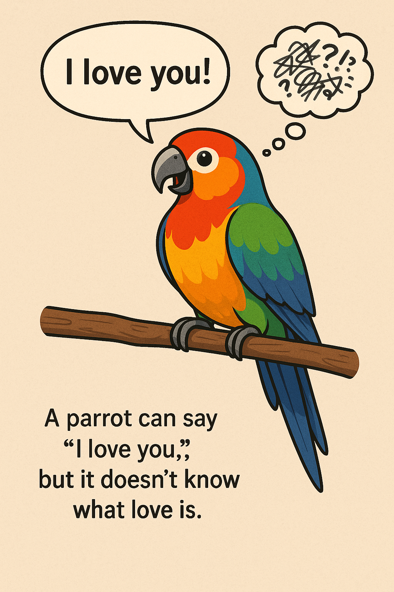

## Definition
An analogy of LLMs that illustrates that the software doesn't have a larger understanding of meaning behind language or the world around it, regardless of how convincing the output sounds. The phrase refers to how a parrot can mimic human words without understanding the meaning behind them.
