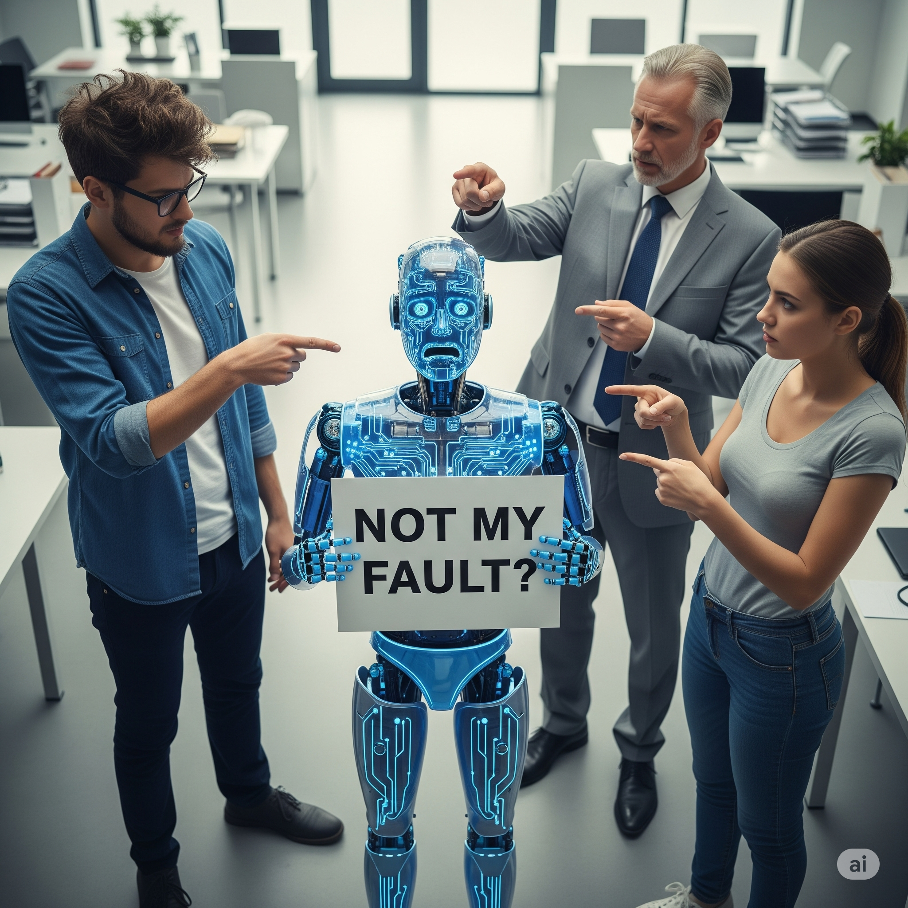
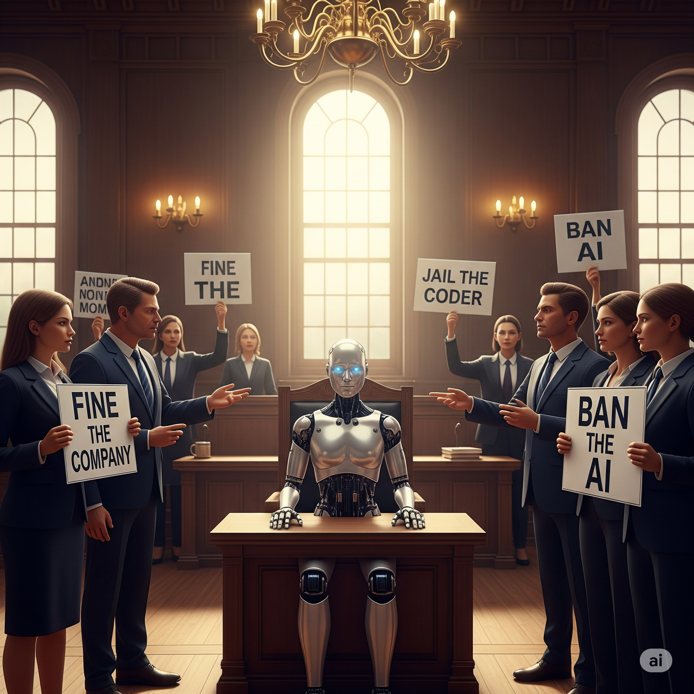

# Who’s Responsible When AI Gets It Wrong?

## 1. **AI Doesn’t Own Its Actions — Humans Do**

<figure class="float-left-figure" style="width: 30%;">
    
    <figcaption class="figure-caption figure-caption-with-title">
      
      Who is to Blame?
       
        When AI fails, the blame doesn’t belong to the machine—it belongs to the humans behind it.
    </figcaption>
</figure>

When an AI system makes a mistake, it isn’t acting with intention. It doesn’t know what it’s doing—it’s simply following patterns it learned from data. Responsibility, then, falls on the humans who designed, trained, deployed, or approved the system. But the big question is: *which humans?* Is it the coder writing algorithms, the company releasing the product, or the user misusing it? This complexity is why AI accountability is one of today’s hottest ethical debates.

**Analogy:**
Think of a self-driving car crashing. The car didn’t *choose* to swerve—it executed code. But who’s at fault: the software team? The company selling the car? Or the driver who trusted it too much?

<!-- and right below this -->

What Does It Mean That AI Doesn’t “Choose”?
Underneath the surface, AI systems—especially those based on machine learning—don’t actually “understand” actions in the way humans do. They operate on statistical inference. For example, a self-driving car doesn't know what a red traffic light means—it recognizes patterns in pixels that usually signal "stop" and feeds that into a pre-trained model that outputs an action. These models don’t have moral agency or intent. When an output goes wrong, we have to trace back through layers of abstraction: Did the dataset have a blind spot? Was the model overfitting certain conditions? Did a subtle bug go unnoticed in testing? Even though the AI executes the action, all its behavior is a reflection of the data and the decisions made during development.

---

## 2. **Accountability Isn’t Just Technical—It’s Legal and Social**

<figure class="float-left-figure" style="width: 30%;">
    
    <figcaption class="figure-caption figure-caption-with-title">
      
      Assigning blame
       
      in AI failures isn’t simple—law and ethics often clash.
    </figcaption>
</figure>

Assigning blame isn’t easy because AI systems are often built by teams spanning countries and companies. Legal systems struggle to keep up: Should we fine the company? Jail a negligent engineer? Ban the AI? There’s also a social dimension—what happens to public trust if AI systems harm people? Real-world examples like biased hiring AIs or faulty medical diagnoses show that even unintentional mistakes can have life-changing consequences.

**Analogy:**
It’s like a factory producing a defective toy that injures children. Do we blame the factory worker, the company leadership, or regulators who didn’t catch the flaw?

<!-- and right below this -->

Why Legal and Social Responsibility Is So Hard to Assign
AI technologies often involve socio-technical systems—meaning they’re shaped not just by code and hardware, but also by legal structures, team dynamics, and cultural norms. For example, if a predictive policing algorithm disproportionately targets a certain neighborhood, it might be using mathematically valid logic but still cause unfair social harm. Legally, this raises difficult questions: Can or should an algorithm be a legal subject? Most frameworks still say no, so courts have to untangle chains of causation from data providers to software engineers to corporate deployment teams. This blurry boundary between intention, negligence, and design complexity is why traditional laws often lag behind emerging AI issues.

---

## 3. **Shared Responsibility: Building Safer AI Together**

<figure class="float-left-figure" style="width: 30%;">
    
    <figcaption class="figure-caption figure-caption-with-title">
      
       
      Safe AI needs everyone—builders, regulators, and users—to share responsibility.
    </figcaption>
</figure>

The most realistic approach is shared responsibility. Developers must test and monitor their models carefully. Companies need to be transparent about risks and limits. Governments should set guardrails through laws and regulation. And users, too, should understand AI’s boundaries and avoid blind trust. Teaching future AI builders—like your students—to think about these issues early is key to building safer systems.

**Analogy:**
Think of air travel safety. It works because engineers design carefully, regulators set standards, airlines train staff, and passengers follow rules. AI may need the same kind of ecosystem.

<!-- and right below this -->

How AI Engineers Manage Risk—Or Fail To
In real-world development, building “safe” AI involves a whole lifecycle of checks: data audits, model validation, adversarial testing, and post-deployment monitoring. Modern engineers use fairness metrics (e.g. equalized odds), interpretability tools (like SHAP or LIME), and model cards to publicly explain limitations. But not all systems go through this full process—tight deadlines, team silos, or business incentives can lead to skipped steps, reducing accountability. That’s why frameworks like Ethics by Design or Responsible AI are emerging—to ensure ethical thinking isn’t an afterthought. With more advanced students like you entering this field, it’s essential to learn how to blend rigorous engineering with ethical foresight.

---

## Interactive Activity: 
### **Who is Responsible? Debate**

---

Think of these hypothetical AI failure scenarios:

`* A self-driving car runs a red light and causes an accident.`
`* A hiring algorithm rejects qualified candidates due to biased training data.`
`* A medical AI misdiagnoses a patient.`

For each, decide:
**“Who should be held responsible—and why?”**

If in a classroom: 
Divide students into groups representing **developer**, **company**, **regulator**, and **user** roles. Let them debate their positions, then discuss as a class.

But you can play each role yourself!

---

## Interactive Instant Quiz

<!-- Question 1 -->

<!-- Question 2 -->

<!-- Question 3 -->

