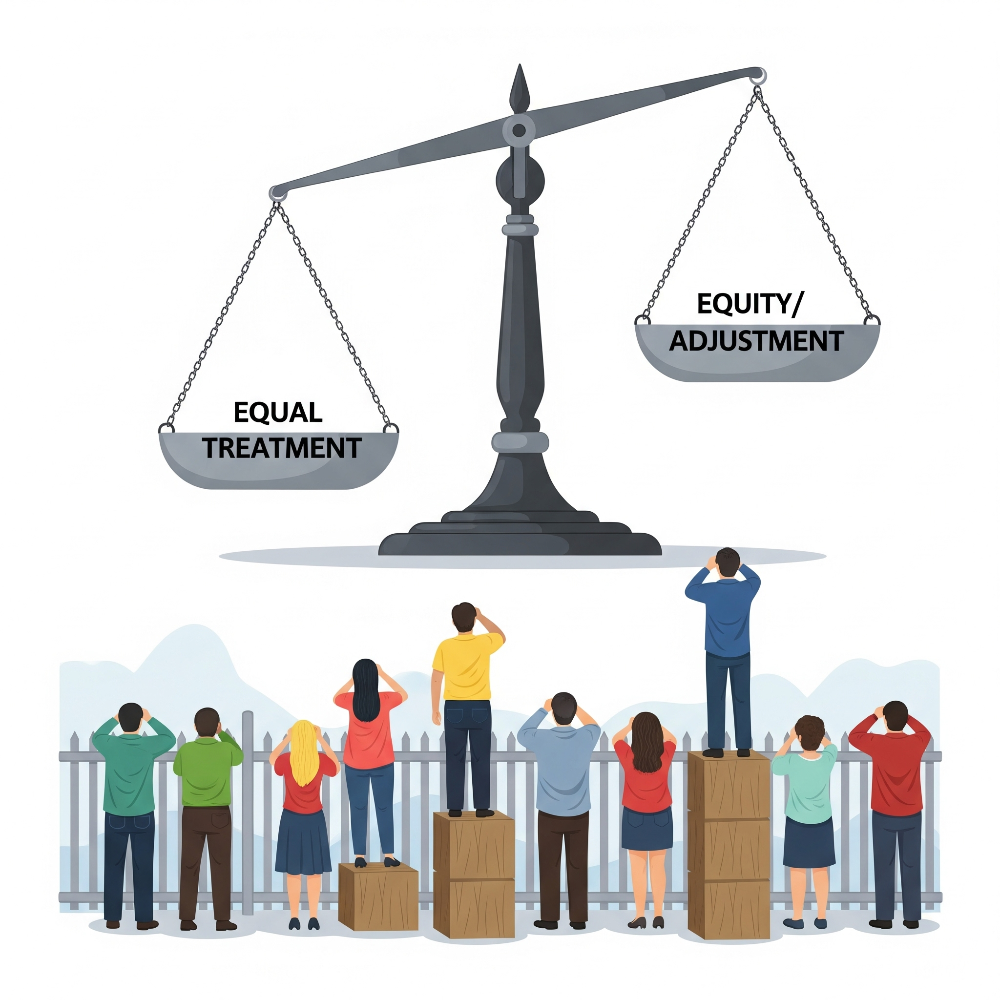

# Is AI Always Fair? Spoiler: Not Really

## 1. **AI Is Not Neutral — It Mirrors Its Training Data**
<figure class="float-left-figure" style="width: 30%;">
    
    <figcaption class="figure-caption figure-caption-with-title">
      Neutral?
       
      AI reflects what it is shown
    </figcaption>
</figure>

Many people assume AI systems are “objective” because they run on math and code. But AI learns from the data it’s fed, and that data comes from humans—with all our biases, stereotypes, and blind spots baked in. If a hiring AI is trained on historical resumes where most CEOs are male, it might unconsciously favor male candidates in its predictions. The system isn’t “choosing” to be unfair, but it reflects patterns in the data.

**Analogy:**
Imagine teaching a robot about beauty using only pictures from one culture. The robot will learn that beauty looks a certain way and ignore everything else.

1. Behind the Curtain: How Training Data Shapes an AI’s Mind
Underneath the surface, modern AI models—especially those like neural networks—learn patterns by adjusting millions or even billions of internal weights, which are just numbers optimized to detect patterns in the data they see. These weights don’t carry meaning on their own, but they collectively create a complex web of associations. For a language model, for example, if the training data contains more examples of "doctors" associated with male pronouns, the model internally reinforces those associations through statistical correlations. Unlike traditional if-then logic, these learned patterns are not interpretable by humans, making it especially difficult to detect and correct biased associations once the model is trained.

---

## 2. **How Bias Creeps In: From Data to Design**

<figure class="float-left-figure" style="width: 30%;">
    
    <figcaption class="figure-caption figure-caption-with-title">
      Neutral
       
      Small cracks in data lead to big problems in decisions
    </figcaption>
</figure>

Bias doesn’t just come from bad data; it also seeps in through design decisions. What labels do we use? Who decides which data is “representative”? Which edge cases get ignored? Even something as small as not testing a facial recognition system on darker skin tones can lead to catastrophic errors. Bias is like a crack in the foundation of a house—it may start small, but it can affect everything built on top of it.

**Analogy:**
It’s like training a language model only on 1950s textbooks. Don’t be surprised if it writes with outdated ideas.

2. Design Bias: Deciding What 'Counts' in AI Development
Even before training starts, AI developers make critical decisions that can inject bias into models. Preprocessing steps like choosing which features to include, how to clean the data, or how to define targets (e.g., who "succeeds" in a hiring model) are part of a pipeline. Additionally, deep learning models often require balanced or augmented datasets, but if you lack enough diverse representation (say, facial images with varied lighting or heritage), the model may generalize poorly for underrepresented groups. Tools like confusion matrices and performance metrics by demographic subgroup are used to detect this, but many commercial models skip these checks altogether due to cost, time, or lack of regulatory pressure.

---

## 3. **Fairness Is Hard — and Worth Fighting For**

<figure class="float-left-figure" style="width: 30%;">
    
    <figcaption class="figure-caption figure-caption-with-title">
      Neutral
       
      What does fairness mean?
    </figcaption>
</figure>

Fairness in AI isn’t as simple as flipping a switch. Sometimes, “fairness” itself is tricky to define: Is it treating everyone the same, or adjusting for historical disadvantages? That’s why diverse teams, critical thinking, and constant testing are crucial in AI development. As future users—and maybe builders—of AI, students should learn to ask: *“Who benefits? Who might be harmed?”*

**Analogy:**
Think of a teacher grading essays fairly. It’s not just about being consistent; it’s also about understanding each student’s background and giving everyone a fair chance.

3. Fairness Algorithms: Can You Code Equity Into Math?
Researchers have developed technical frameworks for fairness in machine learning—tools like demographic parity, equalized odds, and counterfactual fairness. Each method tries to mathematically define what it means for an AI to be “fair,” but none are perfect, and they often conflict. For instance, striving for equal outcomes (demographic parity) might lower overall accuracy, while focusing only on accuracy could perpetuate inequities. This creates challenging moral and design trade-offs: should a loan-approval AI prioritize historical repayment data, even if it's biased, or should it correct for past injustice at the risk of financial error? These are hard questions with no purely technical answers—which is why ethics and human judgment are essential in building AI.

# 💡 Interactive Activity: **“Is This Fair?”**

Now, you be the judge

Do you think these Examples are "fair" or "unfair"? By how much?

* `A résumé screening AI that prefers candidates from certain zip codes.`
* `A photo tagging AI that mistakes darker skin tones for shadows.`
* `A language model that suggests “doctor” when prompted with “man” and “nurse” when prompted with “woman.”`

Question: What was in the training data that led to these...

- * *“What data might have led to this?”*
- * *“How could the system be improved?”*

## Interactive Instant Quiz

<!-- Question 1 -->

<!-- Question 2 -->

<!-- Question 3 -->

