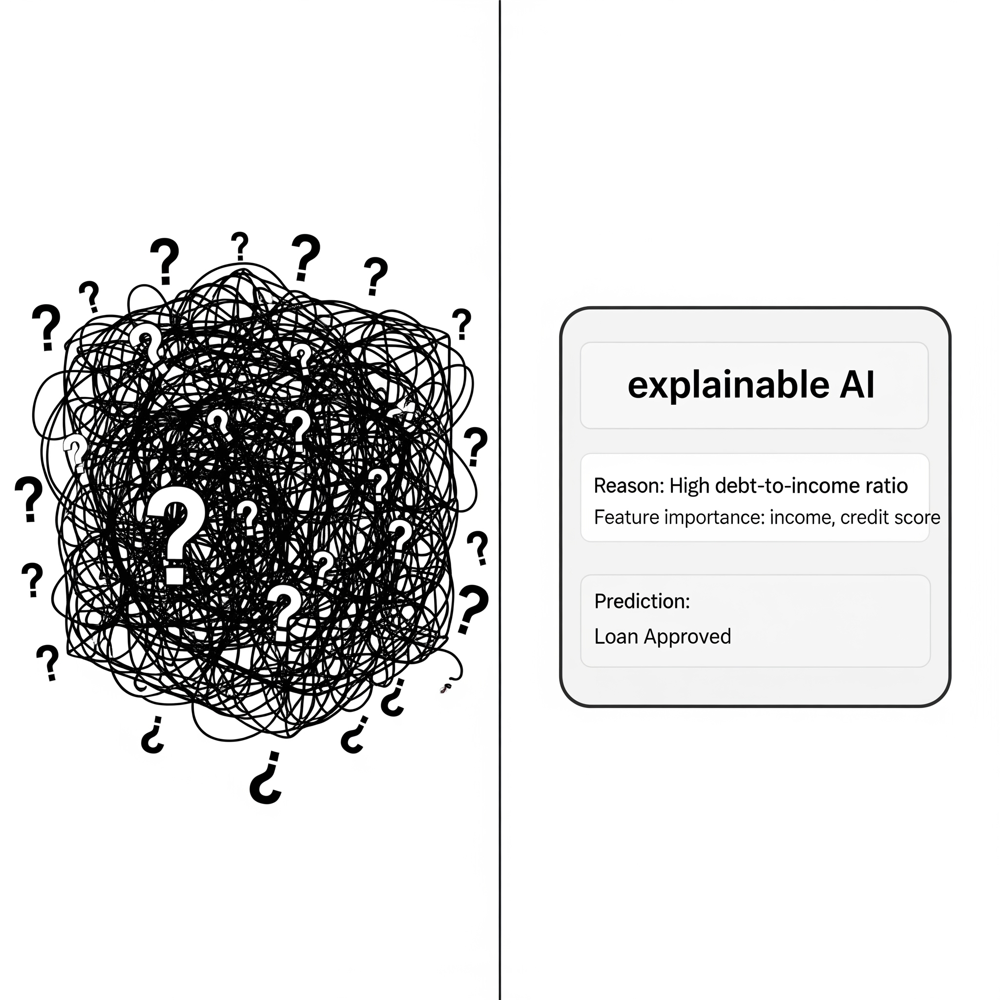

# AI Can’t Explain Itself — Should That Worry Us?

## 1. **What Is a “Black Box” in AI?**
<figure class="float-left-figure" style="width: 40%;">
    
    <figcaption class="figure-caption figure-caption-with-title">
      
      Explainability
       
      We know the input and output—but what’s happening in between?
    </figcaption>
</figure>

Many modern AI systems, especially deep learning models, are so complex that even their creators can’t fully explain how they reach a decision. Each layer of a neural network processes data in abstract ways, turning inputs into outputs without clear “if-then” rules. This opacity is why we call them “black boxes”: you can see what goes in and what comes out, but the process in between is hidden.

**Analogy:**
It’s like a magic vending machine: you press a button, and a snack comes out, but you have no clue how it decided which snack to give.

**Image Idea:**
A vending machine labeled “AI” with question marks on its glass. Inside, gears and tangled wires glow mysteriously.
**Caption:**
*"We know the input and output—but what’s happening in between?"*

<!-- and right below this -->

**What Happens Inside the Black Box?**

Behind the “black box” label lies a web of mathematical transformations. Modern deep learning models—such as neural networks—break down data into tiny numbers and pass them through dozens or even hundreds of layers, each tweaking or amplifying some features while ignoring others. Each layer is mapped and adjusted during training as the system compares its guesses to the correct answers and slowly nudges its inner settings to improve. Developers can see how the network is wired, but after training, the logic linking input to output is often spread across millions of tiny calculations—making it nearly impossible to trace exactly why the AI made a particular choice at each step[1][2][3].

---

## 2. **Why Explainability Matters**
<figure class="float-left-figure" style="width: 30%;">
    
    <figcaption class="figure-caption figure-caption-with-title">
      
      AI Making Decisions:
       
When decisions affect lives, ‘just because’ isn’t a good answer.
    </figcaption>
</figure>

When AI suggests a playlist or predicts weather, a black box might be harmless. But when it denies a loan, flags a job applicant, or recommends a medical treatment, we need to know why. Without explainability, people can’t challenge unfair decisions or correct mistakes. This lack of transparency risks eroding trust in AI systems.

**Analogy:**
Imagine being graded by a teacher who refuses to explain why you lost marks. Even if they say, “Trust me, it’s correct,” it doesn’t feel fair.

**Image Idea:**
A person standing in front of a giant AI screen showing “Decision: Loan Denied” with no explanation, holding a sign: *“Why?”*
**Caption:**

<!-- and right below this -->

**The Challenge of Making AI Decisions Understandable**

Why don't we just peek inside and read the AI’s reasoning? Unlike a traditional program with clear steps, deep AI models make decisions based on abstract patterns and statistical associations in data[1][2]. This is why a neural net might weigh hundreds of features from your loan application but can’t simply print out an “if-then” rule like a human would use. Tools called “explainers” or “interpreters” are being developed to shed some light, such as methods that highlight which input features were most important for a decision or that compare a new case to similar examples from the past[5]. Still, these explanations are often themselves statistical and may not satisfy human curiosity or legal requirements for fairness and accountability.

---

## 3. **Building AI That Can Explain Itself**

<figure class="float-left-figure" style="width: 30%;">
    
    <figcaption class="figure-caption figure-caption-with-title">
      
      "Explainable AI"
       
        Explainable AI opens the box—at least a little.
    </figcaption>
</figure>

Researchers are working on “explainable AI” (XAI) systems that provide reasons for their decisions—highlighting which features mattered most or showing similar past cases. While this can’t solve all transparency issues, it’s a step toward accountability. As future AI users and creators, students should ask: *“Would I trust this system if I don’t understand it?”*

**Analogy:**
It’s like asking a GPS not just for directions, but also why it chose that route over others.

**Building (and Testing) Explainable AI**

Developers who want to build more transparent AI use special design techniques. They might select algorithms that are easier to interpret (like decision trees), add “explanation layers” that summarize key factors, or routinely test their system with “what-if” simulations to see how small input changes affect outputs[5]. Some cutting-edge systems even generate plain-language justifications using generative AI, bridging the gap between code and human understanding[5]. Despite these advances, explainability usually comes with trade-offs—sometimes simpler, more explainable models may not be as accurate as highly complex ones, so engineers have to balance clarity, trust, and performance in every project.

# 💡 Interactive Activity: **The Black Box Guessing Game**
---

**Setup:**

* Teacher secretly writes a sorting rule (e.g., “Sort students by shoe size” or “Sort words by vowel count”).
* Students feed inputs (like their names, numbers, or objects) into the “black box” (teacher applies the secret rule).
* After several rounds, students try to guess the hidden logic.

**Debrief Questions:**

* *How did it feel not knowing why your input was sorted that way?*
* *What changed when you learned the rule?*
* *Why might this matter for real AI systems making decisions about people?*

---

## Interactive Instant Quiz

<!-- Question 1 -->

<!-- Question 2 -->

<!-- Question 3 -->

