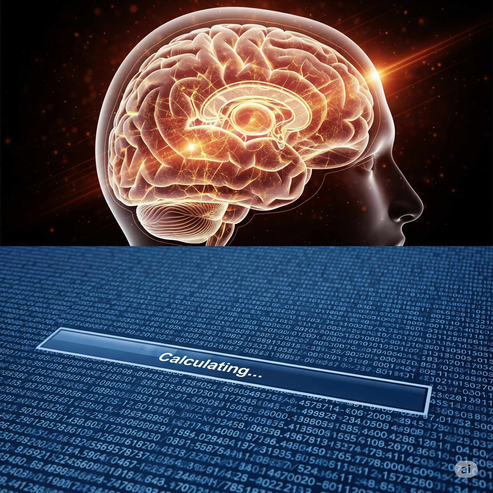
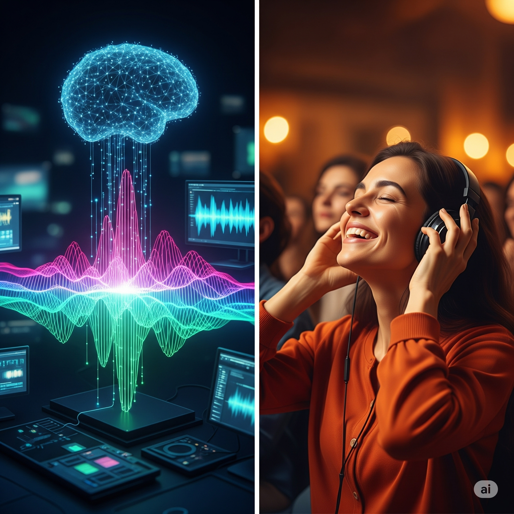
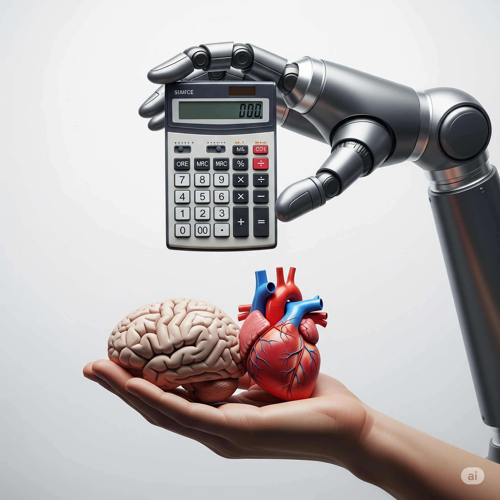

# AI Doesn’t Think — It Calculates (Fast)

When we talk about artificial intelligence, it’s easy to imagine it “thinking” like a human. But here’s the truth: AI doesn’t think. It doesn’t feel. It doesn’t understand. What it does is calculate—millions of times per second —ranking possibilities and picking the most likely outcome. To us, that speed and precision *look like thought*, but it’s really math on steroids.

## 🧠 Humans Think; AI Computes

Humans mix logic, memory, intuition, and emotion when solving problems. We recognize a friend’s face not by scanning pixels, but by connecting memories and context. 
And how does an AI do this? It processes pixel data or text tokens, runs them through equations, and spits out a result. A large language model (LLM) predicts the next word by crunching probabilities across billions of parameters. No imagination, no awareness—just raw calculation.

**Analogy:**  
Think of chess. A grandmaster *feels* a good move, while a computer like AlphaZero calculates millions of moves per second. Both decide, but only one actually *thinks*.

Calculating at Scale: The Machinery Behind AI’s “Thinking”
While it may look like AI is “thinking,” what’s really happening is a staggering amount of number crunching. At the heart of most AI systems are neural networks—mathematical structures inspired by the brain, but purely mechanical. These networks are made up of layers of artificial “neurons,” each performing simple calculations on tiny pieces of data. When you give an AI a question or an image, it converts that input into numbers, passes them through millions (sometimes billions) of these neurons, and produces an output. Each neuron’s calculation is determined by weights—numbers that have been adjusted during training so the network gets better at its task. The speed and complexity come from modern computer hardware, which can perform these calculations millions of times per second, but every step is just math, not thought.

---

## 🔍 Pattern Recognition Isn’t Understanding

AI shines at spotting patterns in huge datasets: certain words often appear together; certain pixel clusters often mean `cat.` But recognizing a pattern isn’t understanding it. When an LLM completes a love poem, it isn’t feeling the emotion -- it’s predicting the next likely word based on patterns it saw during training.

**Analogy:**  
It’s like copying a song’s soundwave perfectly without ever hearing the music. You might get the shape right, but you don’t know the *melody*.

---

## 📐 Logic and Math vs. Intuition and Emotion

At its core, AI is **algorithms, matrices, and functions**—fast, precise, logical. Humans bring something extra: gut feelings, ethical reasoning, and emotional context. An AI might write a convincing apology email, but it doesn’t *feel* sorry—it’s just replicating patterns from similar sentences.

**Analogy:**  
Picture a calculator solving `42 × 17` instantly. Flawless, fast, but *utterly unaware of why the answer matters*.

 Pattern Recognition: Training, Data, and Limitations
AI’s ability to spot patterns comes from a process called training. During training, the AI is shown vast datasets—text from books, images from the internet, recordings of speech—and it learns to associate certain inputs with certain outputs. For example, a language model like ChatGPT is trained on billions of sentences, learning statistical relationships between words and phrases. The “understanding” is really just the AI finding which patterns most often go together. It doesn’t know what a cat is; it knows that certain pixel arrangements are labeled “cat” in its data. The model adjusts its internal weights to minimize mistakes, but it never gains awareness or comprehension. This is why AI can generate realistic text or recognize images but can also make mistakes that a human never would—because it’s matching patterns, not truly understanding meaning.

---

## 💡 Thought Experiment: Does AI Know It’s Talking to You?

Ask yourself:  

When you chat with a language model, does it know you’re there? Does it have a sense of self?  

Here’s the answer: No. AI has no awareness of you, or even of itself. It doesn’t understand words—it predicts tokens based on probability.  This is pure statistics and math at work.

**Try this:**  
Complete this nonsense sentence:  

`"The purple banana sings softly to the anxious cloud..."  `

Can AI finish it? Yes. Does it understand the silliness? 

*Not at all*.

Building Blocks: Algorithms, Optimization, and Human Input
Behind every AI are algorithms—step-by-step instructions that tell the computer how to process information. Training a modern AI model involves optimization: a process where the system tweaks its internal weights to improve performance, guided by a mathematical function called a loss function. This process is computationally intensive and often requires powerful graphics processing units (GPUs) running for days or weeks. But even the best algorithms need human input: engineers decide what data to use, how to structure the model, and how to evaluate its performance. They also set boundaries to avoid harmful or biased outputs. Ultimately, AI’s “intelligence” is a blend of clever math, massive data, and human guidance—no intuition, emotion, or self-awareness involved.

---

## Interactive Instant Quiz

<!-- Question 1 -->

<!-- Question 2 -->

<!-- Question 3 -->

