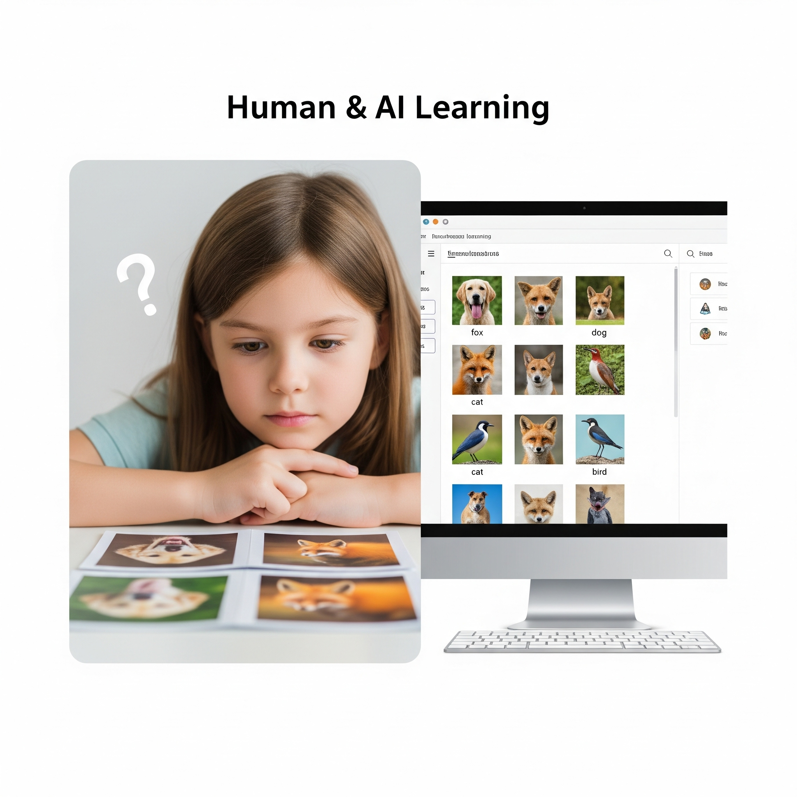
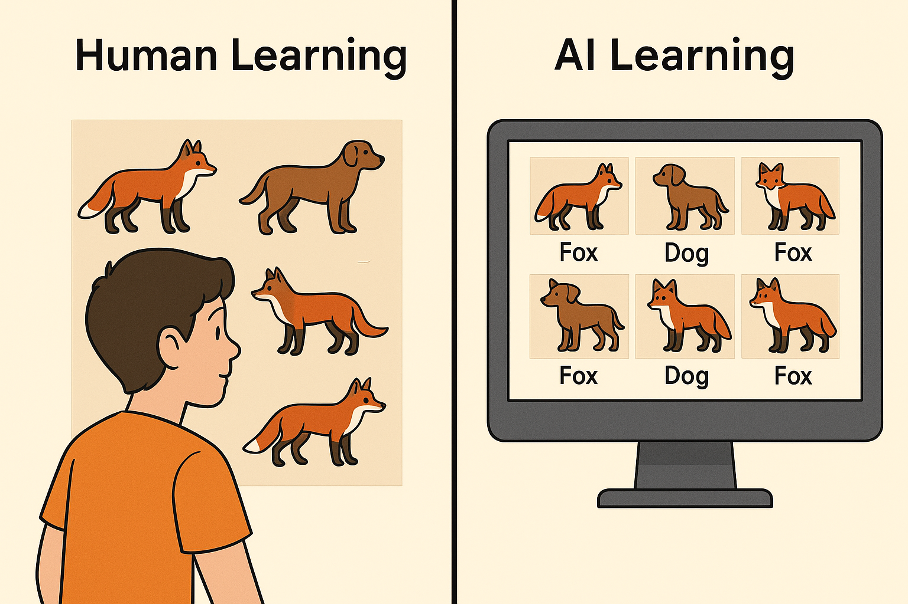

# Learning from Examples: How AI Gets Smarter Over Time

## How Humans Learn vs. How AI Learns

Can you explain to another person how to distinguish between a `dog` and a `fox`? It is surprisingly difficult! And yet, most of us can tell the two apart very easily. "Have you ever learned to recognize foxes by looking at many `fox` pictures? At first, you may confuse a wolf or a fox for a `dog`, but over time, you get better at spotting the difference. 
"I just know it!," you might tell a friend. But I can't explain it.

Similarly, an AI learns in a similar way—but with millions of examples!"

AI learns in a similar way. It doesn’t truly “understand” like humans do, but it gets very good at spotting patterns in data. Just like you can tell a mango from a banana by looking at key differences, AI looks for signals in the data to make its best guess.

---

## Training Data: The AI’s Homework

For AI to learn, it needs examples. Lots of them. AI's are data-hungry!

We refer to this collection of examples as **training data**. Each example comes with a **label**—something that tells the AI what the correct answer is. ("Our dataset is `labeled`)

For example:
- A photo labeled `“cat”`  
- A sentence labeled as `“positive”` or `“negative”` in sentiment analysis  
- An email marked as `“spam”` or `“not spam”`

The AI looks at these labeled examples, again and again, trying to figure out what patterns link the input to the label. It’s like doing 1,000 practice math problems. The more variety and quantity in the training data, the better the AI learns.

## Learning from Mistakes: Practice Makes (Slow) Progress

AI doesn’t get everything right on the first try.

AI too makes a lot of guesses! But after each guess, it was correct by comparing its prediction with the true label. If it’s wrong (uh-oh!) it adjusts itself slightly and tries again with the next example. We can think of this as micro-feedback. This process repeats thousands (or even millions) of times.

This is similar to how we improve when studying for a test. When we get a practice question wrong,  we review the solution (hopefully!), understand our mistake, and do better next time.

For AI, this back-and-forth is called **training**, and each round is like another lap in a practice session.

## Good Examples Matter

AI is only as good as the data it learns from.

If the training data is incomplete, biased, or filled with mistakes, the AI will learn the wrong patterns.

**Example:**  If you only train an AI to recognize dogs using pictures of brown dogs, it may fail to recognize white or black dogs as dogs.

In real life, this can cause problems—like AI systems failing to recognize certain accents, faces, or languages—because the training data wasn’t diverse enough.

Here's one thing that people who are building and improving AI systems worry about a lot: Whether they have included a wide range of examples during training.

---

## Over time, it gets smarter

AI doesn’t magically know things. It learns—just like you do—from practice, examples, and lots of feedback. The next time your phone recommends a video or suggests a word as you type, remember: that’s the result of millions of examples, training sessions, and small adjustments customized for you. 

It just seems very smart!