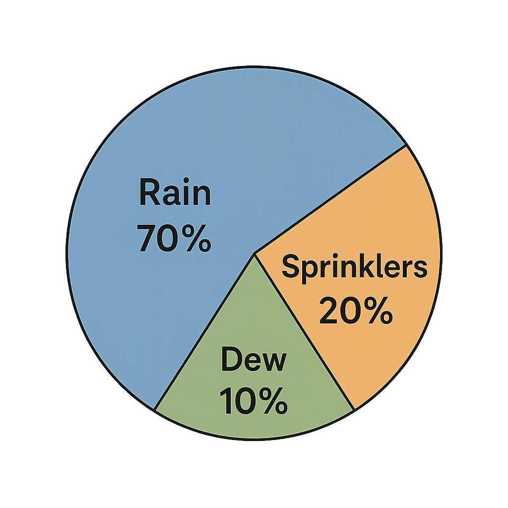
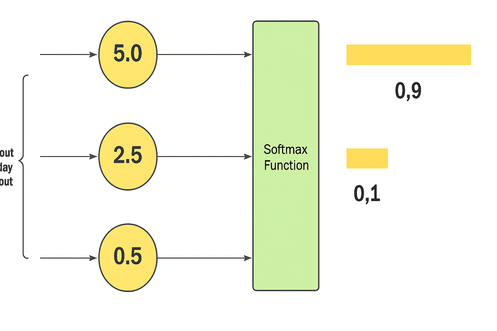

# The Math Behind AI Magic

In this lesson, we'll quickly look at 3 core math ideas that make AI Language Models work.

1. Next word Probability Distribution
2. Sampling based on the probability
3. SoftMax

### Math Idea 1
## Using Probability Distributions to Complete Sentences  

When an AI model writes text, it doesn’t just guess — it calculates probabilities for *every possible next word* based on everything that came before. 

AI models don’t “know” language the way humans do — they *model* it using statistics. Each time a word is generated, the model scores *every word in its vocabulary* (which can be 50,000+ words!) using a combination of pattern recognition and probability. 

But it would be silly to give an equal probability to every word. Some words are more likely than others to follow. Think of rolling a dice, but it is weighted artifically so that 6 and 5 come up more often. (This would be illegal in a casino setting!)

The idea behind core AI is shockingly simple -- the words that fit better get the highest probability. For example, after the phrase `“I want to drink some…”`, the model might assign probabilities like `water` (0.6), `juice` (0.399), `oil` (0.0005), and `sand` (0.0005). 

These add up to 1 — just like any probability distribution. 

### Math Idea 2
## Ranking and Sampling — AI’s Word Guesses Variety

The model doesn't simply pick the highest one. That's often referred to as a `greedy heuristic.` 
Simple reason not to be greedy: that would the sentences TOO predictable.
It is programmed to **sample** from the distribution to introduce variety. In the image of that pie chart, `rain` is more likely to be sampled than `dew`. But both can occur.

This idea is why AI can sound realistic *and* surprising — it’s not deterministic, it’s probabilistic.

### Math Idea 3
## SoftMax

SoftMax is a very elegant idea that sounds a lot more complicated than it needs to. As we all remember, probabilities need to be between 0 and 1, and all of them must add up to 1.

SoftMax is a using some algebra and exponentiation to achieve that.
But for our purposes, let's care about the intuition.

Intuitively, what the softmax does is that it squashes a vector of size 
K
 between 0
 and 1
.

Largest value will dominate!
Small values will be set to near-zero.

These scores get normalized (often using something called a “softmax” function) to form a ranked list of options. The highest-ranked word is usually chosen — but depending on the setting, the model can sometimes choose a lower-ranked word to be more creative or less repetitive. 

