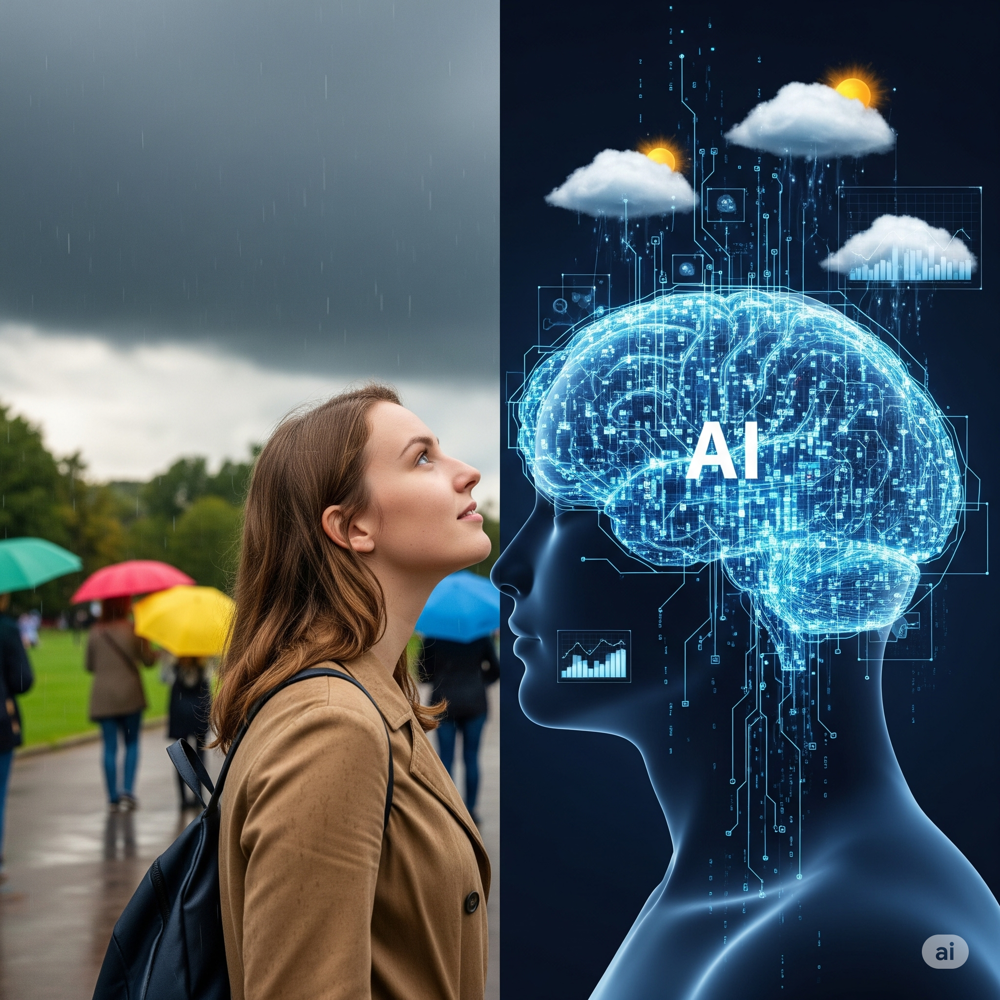
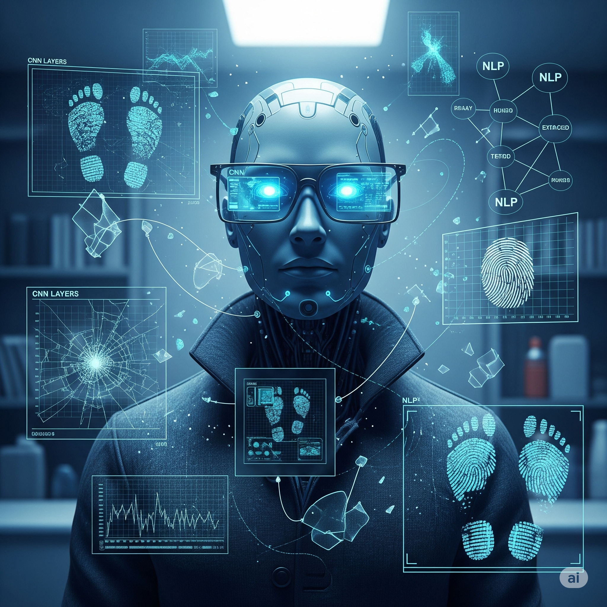
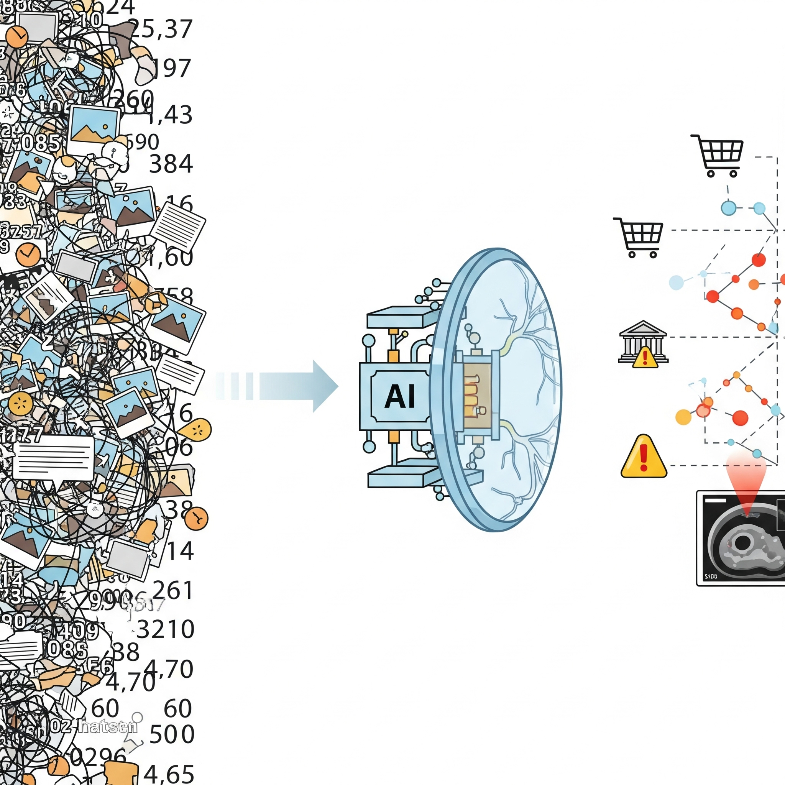

# How Does AI Work?

## Spotting Patterns: The Heart of "Intelligence"

---

## Micro-Lesson 1: Humans are Amazing Pattern-Spotting Machines



You hear a bus approaching.
You grab your lunchbox.

You smell rain and see clouds.
You reach for an umbrella.

Our brains connect clues to make predictions—fast, almost unconsciously.

AI works the same way. But instead of bus sounds and clouds, it spots patterns in millions of data points.

**Key Takeaway:** Pattern recognition is the foundation of what we call "intelligence" - both human and artificial.


---

## Micro-Lesson 2: How AI Spots Patterns



AI doesn’t memorize. It learns relationships.
In vision: it detects edges → shapes → objects.
In language: it tracks word co-occurrences → grammar → meaning.

Deep models like CNNs (for images) and Transformers (for text) extract features and organize them into abstract “latent spaces.”

Think of a detective.
They piece together small clues into a big picture.
AI does the same—mathematically.

**Key Takeaway:** AI builds a hierarchy of features to recognize complex patterns.

<div class="advanced-content" markdown="1">

#### Details for those interested
Machine learning models do not operate on rote memorization; their efficacy stems from their capacity to identify underlying patterns within data. Through exposure to myriad examples, an AI system learns to model the complex, often non-linear, relationships inherent in the data.

In **computer vision**, these patterns manifest as hierarchical combinations of primitive **features**—such as edges, gradients, and textural elements—that, when aggregated, define higher-level concepts like "canine" or "feline." For **natural language processing (NLP)**, patterns involve the statistical co-occurrence of words, grammatical structures, semantic relationships, and contextual dependencies that govern meaningful communication.

This capability is not mystical but mathematically grounded. Algorithms like **convolutional neural networks (CNNs)** for vision or **transformers** for language learn to extract salient **features** and construct intricate decision boundaries or probability distributions that underpin their predictions. The process often involves mapping high-dimensional input data into a more abstract, lower-dimensional **latent space** where patterns become more discernible.

</div>

---

## Micro-Lesson 3: From Patterns to Predictions


Once AI learns patterns, it predicts new situations:

* Flags unusual spending (fraud detection).
* Recommends books you might like.
* Spots early disease in medical scans.

But prediction isn’t enough.
Good AI must **generalize**—work on data it hasn’t seen before.

A model trained only on Labradors shouldn’t confuse cats for dogs.
That’s where diverse training data matters.

**Key Takeaway:** True intelligence means seeing beyond the training set.

<div class="advanced-content" markdown="1">

#### 🔍 Analogy: The Seasoned Investigator
Consider a seasoned detective arriving at a complex crime scene. They don't just see individual clues; they instinctively integrate disparate pieces of evidence—a unique tire tread, an unusual gait pattern from muddy footprints, and the specific fracture mechanics of a broken window—into a coherent narrative. Each clue represents a **feature**, and their collective arrangement forms a **pattern** that points towards the most probable sequence of events or the identity of a perpetrator.

Similarly, machine learning models, particularly those employing deep learning, act as sophisticated investigative systems, sifting through millions of data points to uncover statistically significant correlations and causal links.

</div>

---

## Micro-Lesson 4: Test Yourself

**Sequence Challenge:**
`2, 4, 8, 16 … ?`

Answer: `32`. Simple doubling.

Now try: `5, 10, 19, 40 … ?`
There’s noise (the `19`).
A robust AI would still guess `80`, identifying the core doubling pattern.

**Key Takeaway:** AI must handle imperfect data and still spot the signal.

<div class="advanced-content" markdown="1">
What is the most *likely* next number? While $19$ breaks the simple $\times 2$ pattern, a robust model might still infer an underlying multiplicative relationship perturbed by minor deviations. If we assume the primary pattern is $ \times 2 $, the sequence would be $5, 10, 20, 40$. The $19$ is an anomaly. If the noise is random, the next term would likely still be $80$. If the noise follows a specific pattern, the problem becomes more complex, akin to time-series forecasting with trend, seasonality, and residuals.

**Discussion:** How would a **recurrent neural network (RNN)** or a **transformer** approach such a sequence with noise? They would learn a function that minimizes the prediction error over the entire sequence, potentially identifying the core multiplicative pattern while accounting for the small deviation in $19$. This highlights the importance of **robustness** to real-world data imperfections.

</div>

---

## Micro-Lesson 5: Predict the Word

```
“On weekends, Ravi loves to bake sourdough and brew ___.”

a) Coffee
b) A storm
c) Chemistry experiments
```
You picked `coffee`.
Why? Context and word patterns.

<div class="advanced-content" markdown="1">
Your immediate inclination towards "Coffee" stems from your internalized **n-gram probabilities** and semantic associations learned from extensive linguistic exposure. The collocation "bake bread and brew coffee" has a significantly higher probability than "brew a storm" or "brew chemistry experiments" in typical English corpora.

This process mirrors how sophisticated **large language models (LLMs)** like GPT-4 or Gemini operate. They predict the next token (word or sub-word unit) by calculating its likelihood based on the preceding context and the vast statistical patterns extracted from petabytes of text data. This involves complex attention mechanisms and transformer architectures that weigh the importance of different words in the input sequence.
</div>

Large language models like GPT work the same way.
They calculate probabilities based on context.
**Key Takeaway:** Language AI predicts like you do—using patterns of words and meaning.

<div class="callout callout-advanced" markdown="1"> 
Once robust patterns are extracted, an AI system can leverage them to make informed predictions on unseen data:

* A **fraud detection system** employs **anomaly detection** by identifying transactions that deviate significantly from established normal spending patterns, often relying on statistical thresholds or clustering algorithms.
* A **recommender system** suggests new media by mapping your consumption history to latent feature vectors and identifying items with high similarity scores based on collaborative filtering or content-based methods.
* An **AI-powered diagnostic tool** can identify subtle, early-stage pathological patterns in medical imagery (e.g., MRI, CT scans) that are often imperceptible to the unaided human eye, by learning from vast annotated datasets of healthy and diseased tissue.

This is crucial. effective pattern recognition is not about **overfitting** to the training data. Instead, it's about achieving robust **generalization**, enabling the model to accurately interpret and predict outcomes for novel, previously unencountered examples.

**Why Generalization is Paramount**
A model trained exclusively on images of brown Labrador Retrievers might classify all other dog breeds, or even other four-legged animals, incorrectly. True generalization means the model has learned the underlying invariant features that define "dog" across diverse breeds, lighting conditions, and poses. This capacity is often assessed through metrics like **validation loss** and performance on a completely independent **test set**. Without strong generalization, a model is brittle and lacks real-world utility.

</div>
---

## Micro-Lesson 6: Why Diversity and Ethics Matter

A facial recognition AI trained mostly on one demographic will fail on others.

Data diversity is critical.
Bias in → bias out.

Like a weather model trained only on sunny days.
It’s useless when a storm hits.

**Key Takeaway:** Data quality and ethics define how well AI works in the real world.

---

