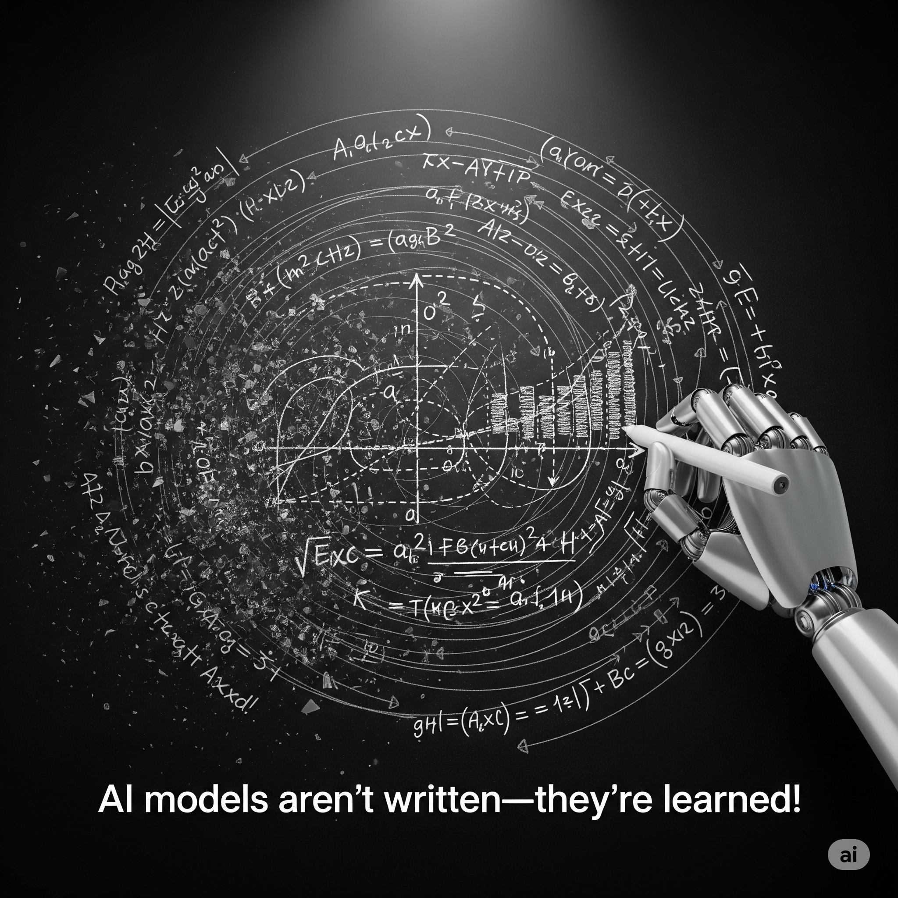
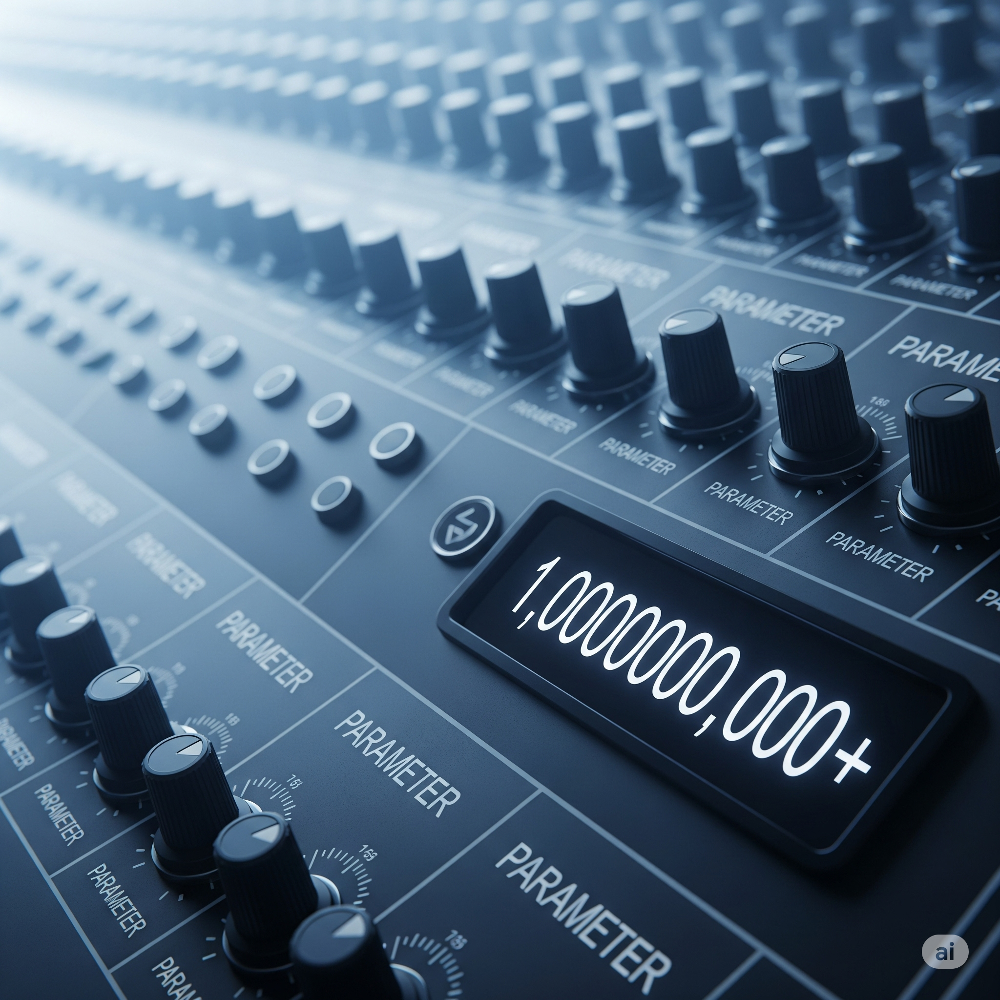

# What’s a Model? It’s Like a Formula With Opinions

### 1.  A `Model` is Just a Smart Formula

A model in machine learning is like a supercharged formula. It takes inputs (like words, images, or numbers) and produces outputs (such as a prediction, a label, or even a drawing).

But here’s the twist: Unlike math formulas you write by hand, an AI model learns its formula by looking at tons of examples. For [large language models](../../glossary/large-language-model-llm.html) (LLMs), this means figuring out how to guess the next word in a sentence by studying patterns in billions of sentences.

*Fun Fact*: A modern AI model can have billions of tiny adjustable parts (called parameters)! That’s a 1 with nine zeros: 1,000,000,000. Not all are used at once, but together, they make the model smart.

**A Model is Just a Smart Formula**
A machine learning model is much more than a static equation; it’s a dynamic, complex system built to recognize patterns and make decisions. For older students, it helps to think of a model as a high-dimensional function with billions of parameters (weights and biases) that define how it processes inputs and generates outputs. Unlike traditional formulas, which are explicitly written by humans, models—especially neural networks—are shaped by optimization algorithms that adjust these parameters during training. For example, in large language models (LLMs), each parameter subtly influences how the model interprets context, grammar, and meaning to predict the next word. The sheer scale—often billions or even trillions of parameters—enables these models to capture intricate relationships in data, but also makes them opaque and challenging to interpret.

---

### 2. **How Data Shapes the Model**

Remember: A model’s “formula” isn’t set in stone. Every time it trains on new data, it tweaks itself—sometimes a little, sometimes a lot!

Imagine you’re learning to play a song by ear. Each time you listen, you notice new details and adjust how you play. Similarly, when a model trains on books, articles, and conversations, it learns grammar, facts, and even the style of writing. If you feed it different data, it might “develop” different opinions or biases—because it reflects what it has seen.

**Training**

The training data is the primary influence on a model’s internal structure and behavior. For older students, it’s important to understand that every example the model sees during training nudges its parameters in a direction that reduces prediction error. This process—often using techniques like stochastic gradient descent—means the model’s “knowledge” is a statistical reflection of its data. If the data contains biases, gaps, or errors, the model will inherit and sometimes amplify those flaws. That’s why LLMs trained on internet text can display both impressive knowledge and problematic biases. Moreover, the diversity and quality of the training data directly determine the model’s generalization ability: a model exposed to varied, high-quality data will be more robust and adaptable, while one trained on narrow or flawed data will be limited and potentially unreliable.

---

### 3. **Why Models Keep Improving**

#### Why Models Keep Improving

Think of a cake recipe you improve each time you bake. Too dry? Next time, add more milk. Too sweet? Use less sugar. A model works the same way: After making a prediction, it checks if it was right, then tweaks itself to do better next time. This feedback loop is what makes AI models so powerful—they’re always learning from their mistakes!

**Why Models Keep Improving**
Modern models improve through iterative training cycles that rely on feedback—either from labeled data (supervised learning), rewards (reinforcement learning), or even self-supervised signals. Each cycle involves the model making predictions, comparing them to ground truth or desired outcomes, and adjusting its parameters to minimize error. For older students, it’s valuable to explore the mathematical underpinnings: loss functions quantify error, and optimization algorithms like Adam or RMSProp guide parameter updates. Over time, this process leads to convergence, where further improvements slow down as the model approaches its optimal configuration for the given data. However, models can continue to improve with new data, advanced architectures, or better training techniques, reflecting the ongoing evolution of AI capabilities.

---

## Interactive Instant Quiz

<!-- Question 1 -->

<!-- Question 2 -->

<!-- Question 3 -->

