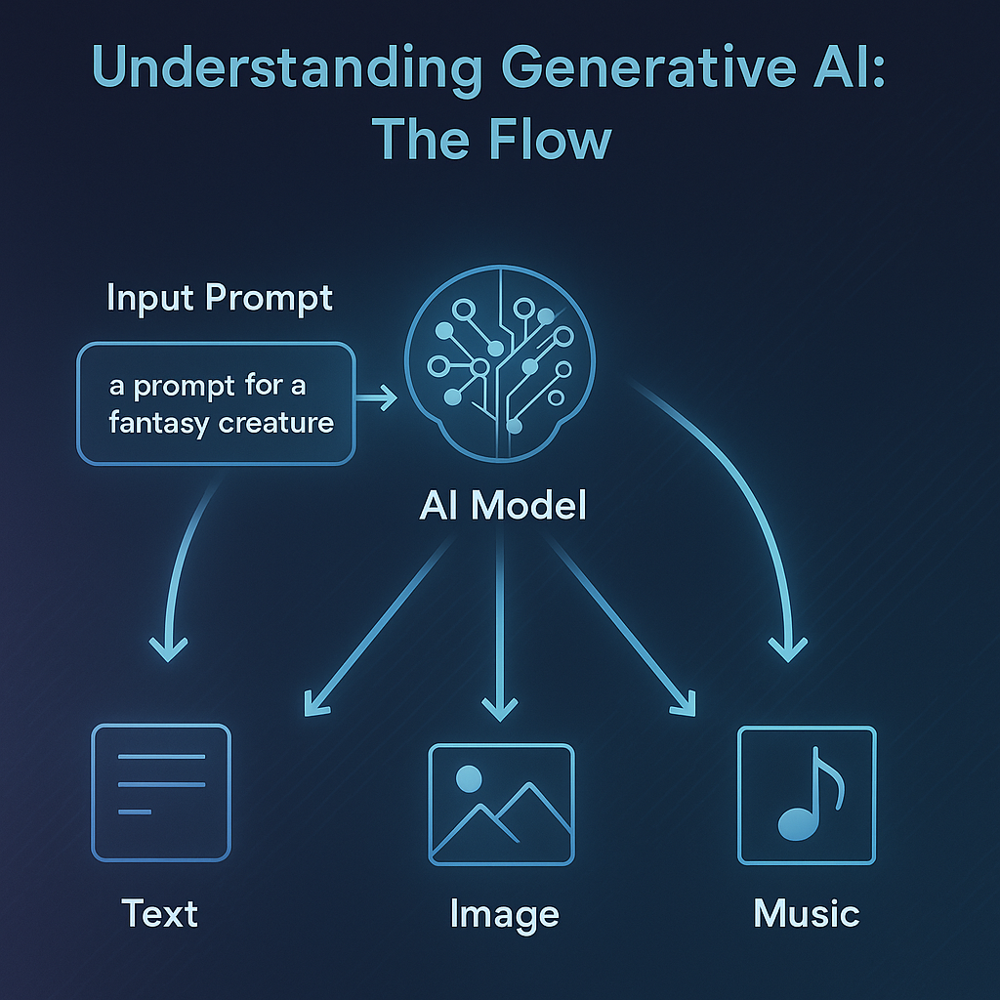
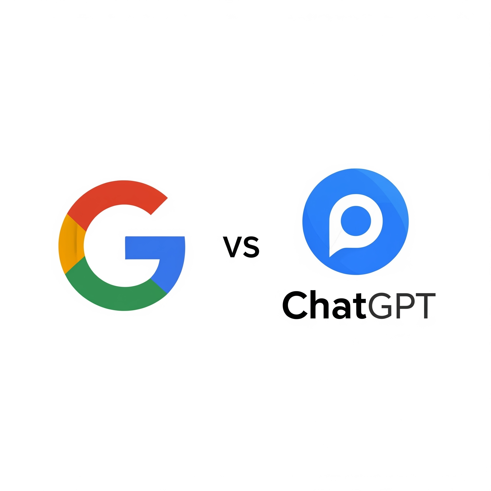

## What is Generative AI, Really?  

Generative AI is a type of artificial intelligence that doesn’t just answer questions—it actually creates new things. 
The important word here is *generative.*
That might mean writing a story, drawing a picture, making up a song, or even helping you write code. 

It does this by learning from huge collections of examples—millions of books, images, sounds, or pieces of text—so it can spot patterns. Then, when you give it a *prompt*, it uses those patterns to predict what would make sense next. It’s like supercharged autocomplete that not only finishes your sentence, but can generate an entire paragraph, image, or song based on what you asked for.

#### Key Difference

But, and this is important, Generative AI doesn’t understand ideas the way humans do. It doesn’t feel creative or know what it’s saying. Instead, it’s really good at predicting what kind of content “fits” based on what it has seen before. 

Think of it like a remix artist—it doesn’t invent things from scratch, but it can combine pieces of what it’s learned in surprising and impressive ways. The result? New creations that seem smart or artistic, even though they’re really just the product of clever pattern recognition.

---

## Why Is Everyone Talking About It?  

Generative AI feels almost magical because it can do things that, until recently, only humans could—like writing essays, composing music, creating art, or helping with homework. That’s why it’s suddenly everywhere: in the news, in schools, and in the workplace. People are using it to brainstorm ideas, answer questions, and even build apps. But it’s also raising big questions. Can we trust what it generates? Will it replace jobs or just change how we work? And how do we make sure it’s being used in fair and helpful ways?

#### Analogy
One way to think about this shift is to compare Generative AI to inventions like the camera or the calculator. 
- When the camera was invented, people wondered if it would replace painting. 
- When calculators came along, teachers worried that students would stop learning math. 
  
  In both cases, these tools didn’t remove creativity or thinking—they changed how we do those things. 

Generative AI is the same: it’s powerful, it’s new, and we’re still figuring out how to use it wisely.

**Why is Generative AI suddenly everywhere — in the news, in classrooms, even in songs?**

In the last few years, AI tools have grown super powerful. Models like ChatGPT, DALL·E, and Suno have amazed people with how well they create things. It’s a big deal because it changes how we work, learn, and play.

## Generative AI vs Traditional AI

So, what is Generative AI, and how is it different from the other AI we may have heard about?

Imagine you have two friends:

**Friend 1:** who’s really good at looking up facts (that’s like traditional AI).  
**Friend 2:** Can make things — stories, pictures, songs — just from your ideas. That’s Generative AI.

Unlike older AIs that were mostly about rules or finding the right answer, GenAI creates something new. It can write a story, draw a picture, or even suggest code.

#### Analogy

I am fond of analogies to understand things. To relate new concepts to ideas we already know.
You can think of the difference like this: **regular AI** is like a librarian—it helps you find the exact book or answer you’re looking for, based on what already exists. But **Generative AI** is more like an author. Instead of just retrieving information, it creates something new, like writing a brand-new story based on your ideas or prompts.

#### Activity for you

Use Google to search “What is a black hole?” Then ask ChatGPT the same thing. How do the answers feel different?

Throughout this course, we are going to understand many of the ideas behind this "AI revolution"