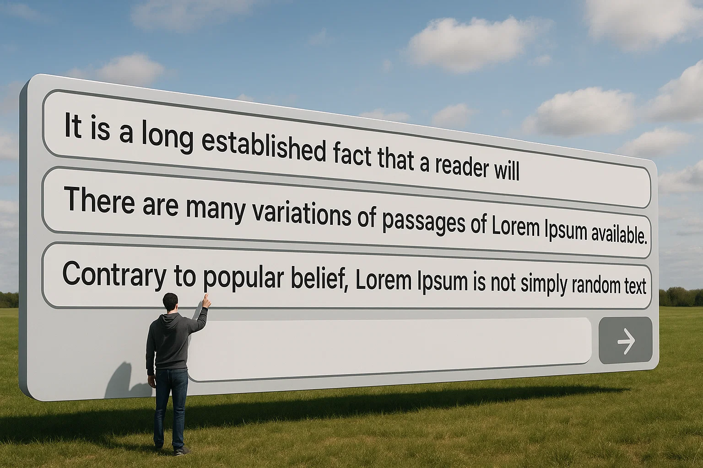
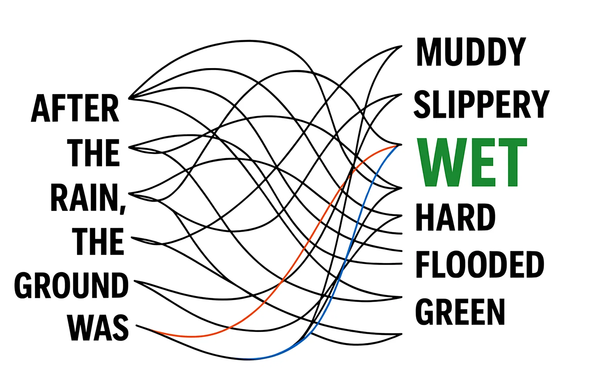

# How Does an LLM Actually Work?


LLMs like ChatGPT work by predicting the next word in a sentence based on patterns they've learned from reading large amounts of text.
This sounds so simple! It is, and also is not. But memorize this fundamental idea:


**Core Concept**: LLMs are incredibly powerful prediction machines that learn patterns from huge amounts of text to guess the next word in a sentence. They don't "think" or "understand" like humans do.


LLMs - The Super-Smart Autocomplete: Imagine a piece of software running on your device (phone or laptop). It's output looks like your phone's keyboard, but *it has read everything on the internet* and is incredibly good at guessing the next word based on all those patterns. There is one very important point we **must** keep in mind -- this software program (we are calling it LLM) doesn't know what the words mean, just how the words usually go together.


### Analogy

I like analogies to understand concepts. See if this one makes sense: Imagine a Master Chef Who has Never Tasted Gourmet Food. An LLM is like this chef who has read every cookbook and memorized every recipe. They know exactly how to combine ingredients to make a dish sound delicious, but they've never actually tasted food, so they don't truly understand what "delicious" is.

### One Giant Guessing Game -- Pretend we are LLMs

Here’s a powerful way to really understand how LLMs work. Let’s play a simple “*Predict the Next Word*” game.
Start with a sentence --

```“The cat sat on the ____” ``` and guess what comes next. 
Most of us will immediately say `“mat”`—because we’ve all heard that phrase before.

That was too easy. Let me give you a slightly trickier one: 

```“After the rain, the ground was ____” ```

Posible responses could be `“wet,” “muddy,” “slippery,”` or even `"flooded."` 

How did we know that? We are using **patterns** and **context** to make your best guess. 


That’s exactly what LLMs do, just on a much bigger scale. And remember, they’ve seen billions of examples, and every time they generate text, they’re just picking one word at a time—whatever seems most likely to come next. They might feel that `wet` is the most likely candidate, followed by `slippery` and then `flooded` and `muddy` is rarer still. You get the idea!

That’s how LLMs answer questions, write stories, and chat with us. It's all *one giant guessing game*, played super fast.

### Training an LLM

Imagine an AI that only ever read sports articles—every game recap, player bio, and trade rumor. What do you think would happen? It would become a total genius at talking sports: writing perfect game analyses or predicting scores.

But here's the catch: ask it about baking a cake, the history of art, or how to fix a leaky faucet, and it would be completely lost, probably just making stuff up.

This highlights a super important idea: an LLM only "knows" what it has been trained on. This massive collection of text, called its "training data," literally shapes everything the AI can, and cannot, do.

### LLMs need the "context"

Okay, let's see how that works with your example:

If you just give an AI `"Paper and ____________"`, it's highly likely to predict `"pencil," "pen,"` or "`glue."` Why? Because in the huge amount of text it's learned from, "paper and pencil" or "paper and scissors" are super common pairs. The AI is drawing on those very frequent patterns to guess what comes next.

Now, add just one word: `"Rock, Paper and ____________"`. Suddenly, that single word "Rock" completely changes the context for the AI. It's no longer just thinking about writing or craft supplies; it's now recognizing the specific game. Because of this new context, its prediction shifts overwhelmingly to `"scissors,"` even though `"paper"` is still there. This shows how incredibly sensitive LLMs are to every word you give them – even a single word can totally redirect what they expect to generate next.

### Using Probability to Pick the next word



So, if an AI doesn't "think" like us, how does it pick the next word? It's all about probability. When an AI tries to guess the next word, it's not thinking. Instead, it looks at all the words it's already generated and then makes a giant list of every single word it knows. Next to each word, it calculates a chance, or probability, of how likely that word is to appear next based on all the patterns it has learned.

For example, after `"The cat sat on the ____________",` `"mat"` might have a 90% chance, `"rug"` 5%, `"dog"` 1%, and `"airplane"` 0.0001%. The AI then basically rolls virtual dice. Most of the time, it picks the word with the highest probability ("mat"). Sometimes, though, to make things more interesting and less repetitive, it might pick a slightly less likely word, which is how you get more varied and natural-sounding responses. It's not choosing in our sense; it's simply picking based on what the numbers tell it is most probable given the context.

If an LLM were "greedy" and always picked the word with the absolute highest probability, its writing would quickly become very predictable and boring. It would always use the most common phrases, sounding repetitive and unnatural. So, to make its answers more interesting and sound more like real human writing, the AI sometimes takes a tiny "risk." Instead of always picking the 90% likely word, it might sometimes choose the 5% word, making the text more varied and creative.

So Training, Context and Probability are some of the reasons for why LLMs work so well. Let's cap this lesson off, with a Predict the next phrase for the song lyrics quiz.

## LLM Quiz - Predict the next words in this song!

For each song, click on the option is the _most likely_ option, given the mood and the rhyme. Try clicking each option to see if you agree with the reasoning.

<div class="quiz-section">

  <h3>1. "Morning Light"</h3>
  <p><strong>Lyrics:</strong></p>
  <pre><code>I opened my eyes,
The sun peeked through,
And danced across the...</code></pre>
  <form id="pop_quiz_song1">
    <label><pre><code><input type="radio" name="pop_quiz_song1" value="A"> cries of flies</code></pre></label>
    <label><pre><code><input type="radio" name="pop_quiz_song1" value="B"> skies of dyes</code></pre></label>
    <label><pre><code><input type="radio" name="pop_quiz_song1" value="C"> blue canoe crew</code></pre></label>
    <label><pre><code><input type="radio" name="pop_quiz_song1" value="D"> zoo kangaroo stew</code></pre></label>
       <div class="quiz-result"></div>    <!-- placeholder for feedback -->

  </form>

  <h3>2. "The Ocean Song"</h3>
  <p><strong>Lyrics:</strong></p>
  <pre><code>The waves crash high,
The seagulls fly,
Their echoes fill the...</code></pre>
  <form id="pop_quiz_song2">
    <label><pre><code><input type="radio" name="pop_quiz_song2" value="A"> sky with sighs</code></pre></label>
    <label><pre><code><input type="radio" name="pop_quiz_song2" value="B"> tide with pride</code></pre></label>
    <label><pre><code><input type="radio" name="pop_quiz_song2" value="C"> pie and fries</code></pre></label>
    <label><pre><code><input type="radio" name="pop_quiz_song2" value="D"> couch with remote</code></pre></label>
       <div class="quiz-result"></div>    <!-- placeholder for feedback -->

  </form>

  <h3>3. "Stars Above Me"</h3>
  <p><strong>Lyrics:</strong></p>
  <pre><code>The stars above me glow,
Whispers in the trees,
Telling me their...</code></pre>
  <form id="pop_quiz_song3">
    <label><pre><code><input type="radio" name="pop_quiz_song3" value="A"> secrets in the breeze</code></pre></label>
    <label><pre><code><input type="radio" name="pop_quiz_song3" value="B"> hopes and pleas</code></pre></label>
    <label><pre><code><input type="radio" name="pop_quiz_song3" value="C"> knees and cheese</code></pre></label>
    <label><pre><code><input type="radio" name="pop_quiz_song3" value="D"> avocado cargo show</code></pre></label>

   <div class="quiz-result"></div>    <!-- placeholder for feedback -->

  </form>

</div>


## Interactive Idea (for teachers)
Let students write a sentence and ask the class to guess the next word, simulating how an LLM operates.


