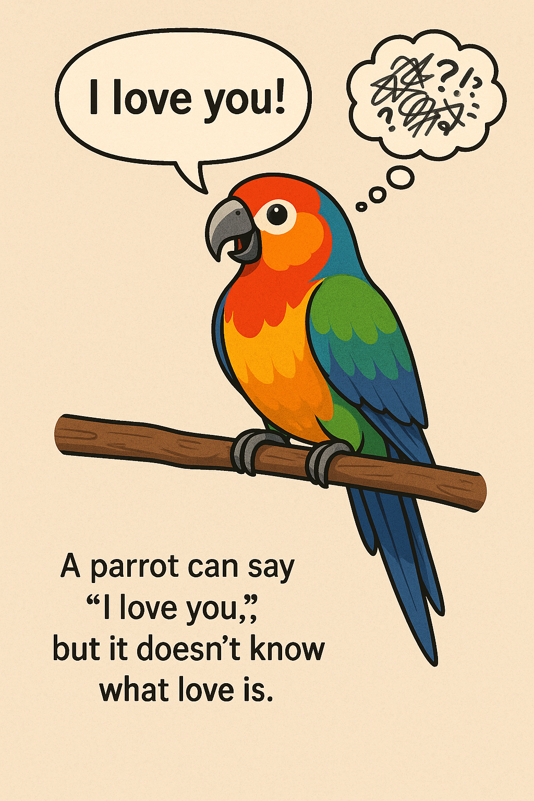

# Why ChatGPT Doesn’t Really ‘Understand’ You

LLMs are great at *generating* language, but they don’t understand context, intent, or emotion like humans do.

LLMs are Pattern-Matching Machines. ChatGPT and similar models are trained on colossal amounts of text data. Through this training, they learn to identify complex statistical relationships and patterns between words, phrases, and concepts. When you give them a prompt, they essentially predict the most statistically probable next word, and then the next, to generate a coherent and relevant response. 

This is a very important point: The LLMs don't understand. They are showing us patterns that they have picked. These are patterns in the words and phrases and sentences.

## The gap between pattern-matching and comprehension

All of us get impressed by the responses. We cannot deny that AI can sound smart without "knowing" anything. Why does this happen?
This is the fascinating paradox that often fools users. Because LLMs are so good at pattern-matching, they can:

- Generate grammatically correct and coherent text.
- Formulate arguments that appear logical.
- Recall vast amounts of information.
- Adapt their style and tone.

All of this gives the impression of intelligence and understanding. However, they don't "know" the facts they state in the way a human knows them; they just know *how* those facts are typically expressed in language. LLMS are very good at imitating humans.

## Illustrative Analogy
A parrot can say “I love you,” but it doesn’t know what love is. But a parrot is very good at imitating voice and sound, without understand.

## Interactive Idea
Give students intentionally confusing prompts and compare their interpretations to the AI’s response.
