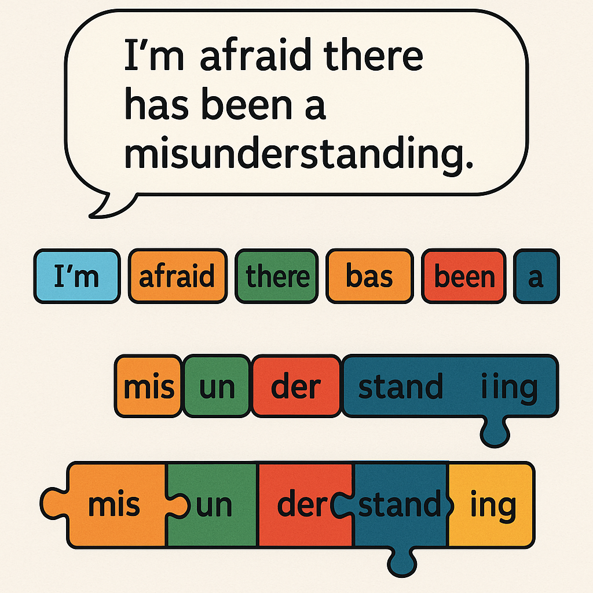
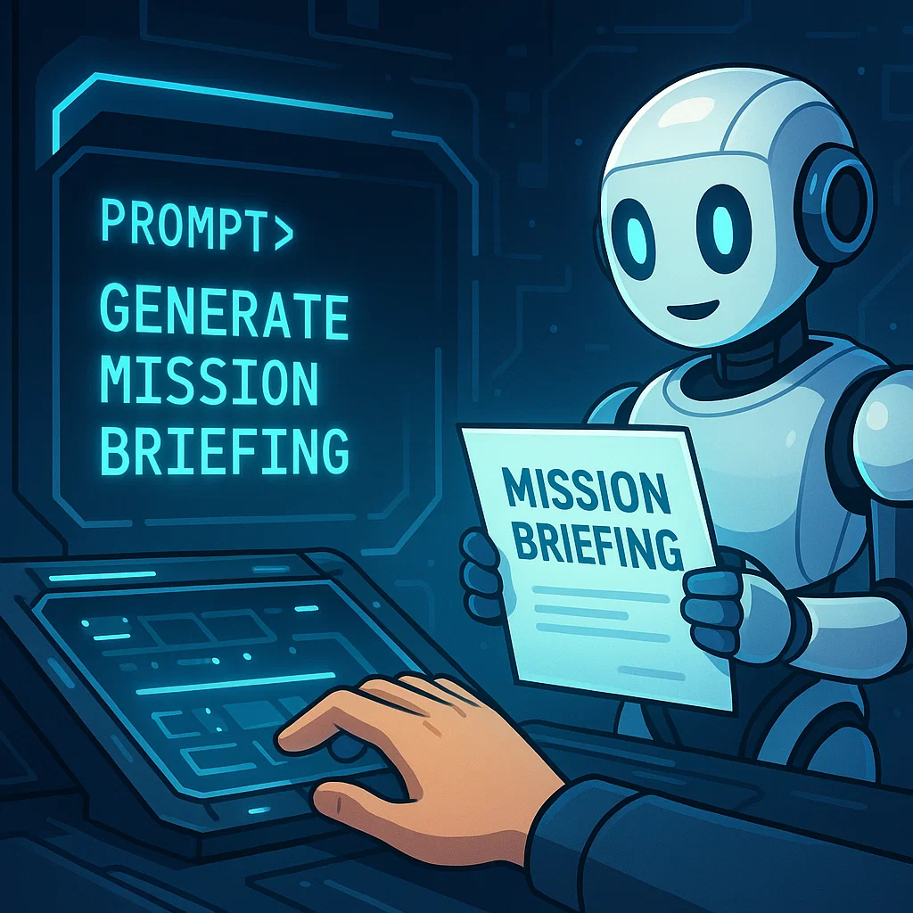
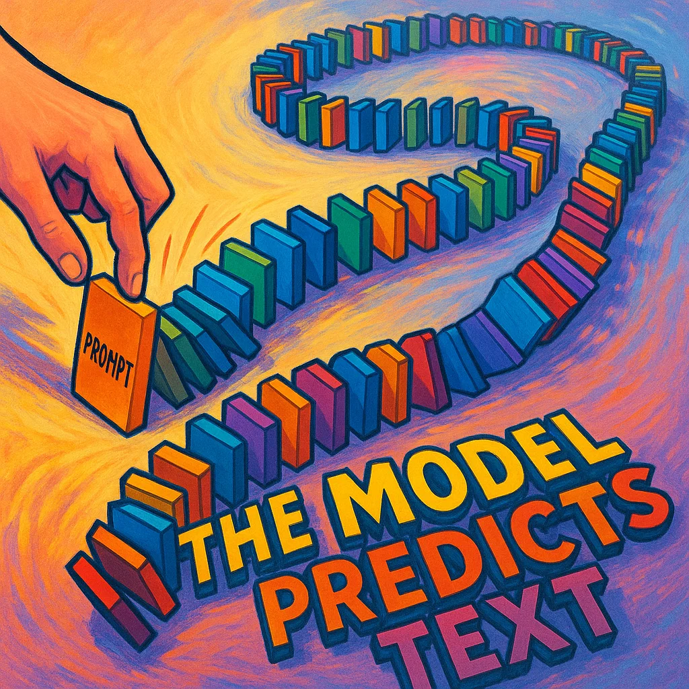

# Tokens, Prompts, and Predictions: The Language of LLMs

In this lesson, we are going to look at 3 concepts:
- Tokens
- Prompts
- Predictions

Taken together, they can be thought of as the language of LLMs

## Tokens: The LLM's "Vocabulary"

**Definition**: Tokenization is the process of breaking text into smaller units (tokens) that an AI model can understand and process.

*Why do we need that?* LLMs don't see words exactly like we do. They break text into "tokens," which can be whole words, parts of words (like prefixes or suffixes), or even individual characters and punctuation. Using these smaller tokens is how LLMs "read" and "write."

   
There are two main approaches to tokenization:
- **Word-level tokenization**: Splits text into complete words. Simple but can lead to very large vocabularies and problems with rare words.
- **Sub-word tokenization**: Breaks words into smaller meaningful pieces (like "un-" + "forget" + "-able"). More efficient and better handles rare words.

This is best understood by examples.

### Examples of Tokenization
1. The word `"unforgettable"` might be tokenized as: `["un"]`, `["forget"]`, `["table"]` (3 tokens) or as  `["un"]`, `["forg"]`, `["ett"]`, `["able"]`. (4 tokens)

2. `"Coding is fun!"` might become: `["Cod"]`, `["ing"]`, `["is"]`, `["fun"]`, `["!"]`

### Tokenization Analogy 

**Musical Notes are tokens**: Think of tokens like musical notes in a song. Just as a musician breaks down a melody into individual notes (C, D, E...), an LLM breaks text into tokens. Like how simple notes combine to create complex melodies, basic tokens combine to form sophisticated words and sentences. Similar to how the same notes can create different songs, the same tokens can be arranged to generate different meanings. Just as musicians learn which note combinations sound harmonious, LLMs learn which token combinations make sense.

## Prompts: Giving the LLM a "Mission"

**Definition**: A `prompt` is the input text that guides an LLM's response. It can be a question, instruction, conversation starter, or even a partial sentence that needs completion. Think of it as the blueprint that shapes how the AI will understand and respond to your request. The prompt's structure, wording, and context all influence the quality and relevance of the AI's output.

### The Captain's Bridge Analogy

Let's use the analogy of a captain navigating. Imagine you're the captain of a starship with an AI navigator. Just like how a captain needs to give clear, purposeful commands to navigate through space:

- The **Command Structure** matters: Just as `"Set course to Alpha Centauri"` is clearer than `"go that way"`, a well-structured prompt gives better results
- Include your **Navigation Context** is crucial: Like how a captain considers current position and obstacles, your prompt should include relevant context
- **Course Corrections** are possible: You can refine your commands (prompts) based on the initial response, just as a captain adjusts course based on feedback

### Example Prompts

- `"Explain quantum physics using a cooking recipe analogy"`
- `"Write a haiku about artificial intelligence"`
- `"Describe the water cycle as if you're telling a bedtime story"`
- `"Complete this sentence: The mysterious package contained..."` 

## Predictions: The LLM's "Best Guess" Chain 🔗

LLMs generate responses by predicting the most likely next token, then the next, and so on, based on the prompt and the vast amounts of text they've learned from. Prediction is therefore a chain of educated and likely guesses.

## Analogies for Predictions

*Dominoes Falling*: The prompt is the first domino. The LLM predicts which domino will fall next (the next token), then the next, creating a chain reaction that forms the answer.

*Finishing a Friend's Sentence*: You can often guess how a friend will finish a sentence because you know them well. LLMs do this with language, having "met" billions of sentences.

## Example Predictions
**Prompt**: `"To make a good sandwich, you need..."`
LLM might predict:
- `"...bread."` (first predicted token)
- `"...bread, cheese..."` (second predicted token chain)
- `"...bread, cheese, and some lettuce."` (longer predicted chain)

To tie all 3 concepts in this lesson, we can say that LLMs break your sentence into chunks called **tokens** and use your **prompt** to **predict** what should come next.

## Interactive Idea
Challenge students to rewrite a prompt in 3 different ways and observe how the AI output changes.
