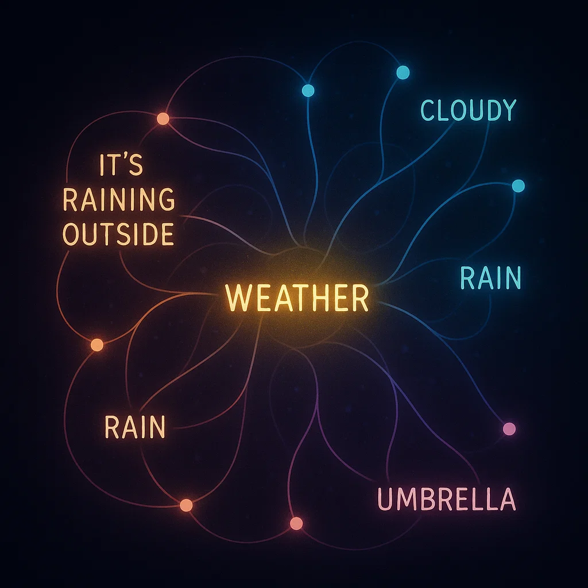
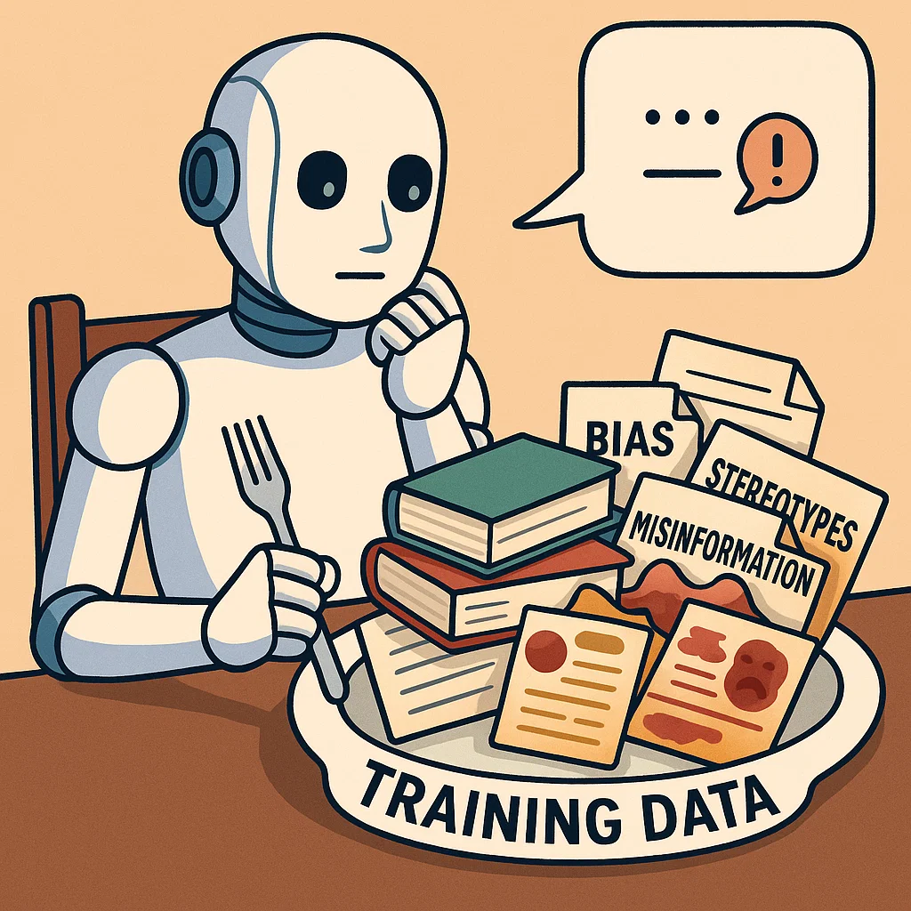

# Training an AI: Reading the Internet at Super Speed

Introduction: Remember how we talked about AI being a super-smart word predictor, but not truly "understanding" things like we do? Well, today, let's dive into *how* it gets so incredibly good at predicting words and building sentences!

### What Does "Training" an AI Actually Mean?

Imagine "training" an AI like sending it to the biggest, fastest language school ever. Instead of regular textbooks, it "reads" **billions and billions of text examples** from everywhere on the internet – think news articles, books, social media, even everyday conversations. This "reading" isn't about the AI understanding a story or feeling emotions; it's all about **spotting connections and patterns** between words and phrases. It learns that certain words often appear together, or that sentences usually follow a particular structure.

---

### The AI's Super-Speed "Reading" (and What It Notices)

Think about a student who **speed-reads every single book in the world's biggest library** in mere seconds. This student remembers exactly where every word appeared, what words were usually next to it, and how sentences are typically put together. That's a bit like how an AI "reads." It doesn't actually grasp the meaning of a novel, but it becomes an absolute master at **recognizing patterns**. It learns that "cat" frequently shows up near "meow" or "purr," and how to construct a grammatically correct sentence about felines. This incredible "pattern spotting" across a massive amount of data is how the AI learns the "rules" of human language, even though it doesn't know *why* those rules exist or what the words truly mean.

---

### The Data Diet: Why What AI "Reads" Really Matters

The specific text data the AI "reads" – its "diet," we could say – directly shapes what kind of responses it will give. For example, if the training data contains **biases** (like stereotypes or unfair language), the AI can accidentally learn and repeat those biases in its own responses. This highlights why it's a huge challenge and responsibility for the people developing AI to carefully select and refine the data used to train these powerful models. The quality and nature of the data are crucial for building helpful and fair AI.

---

Training an LLM means feeding it millions of text examples so it can learn how language works — but it reads without truly understanding.

## Interactive Quiz

<!-- Question 1 -->

<!-- Question 2 -->

<!-- Question 3 -->

