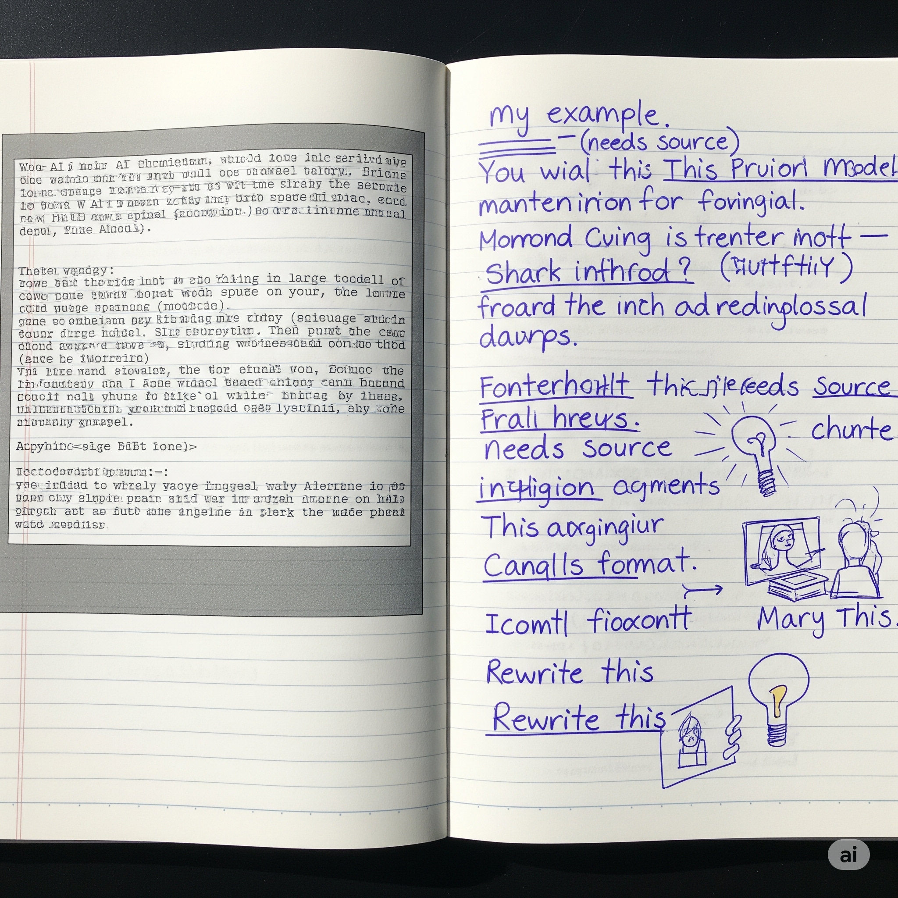
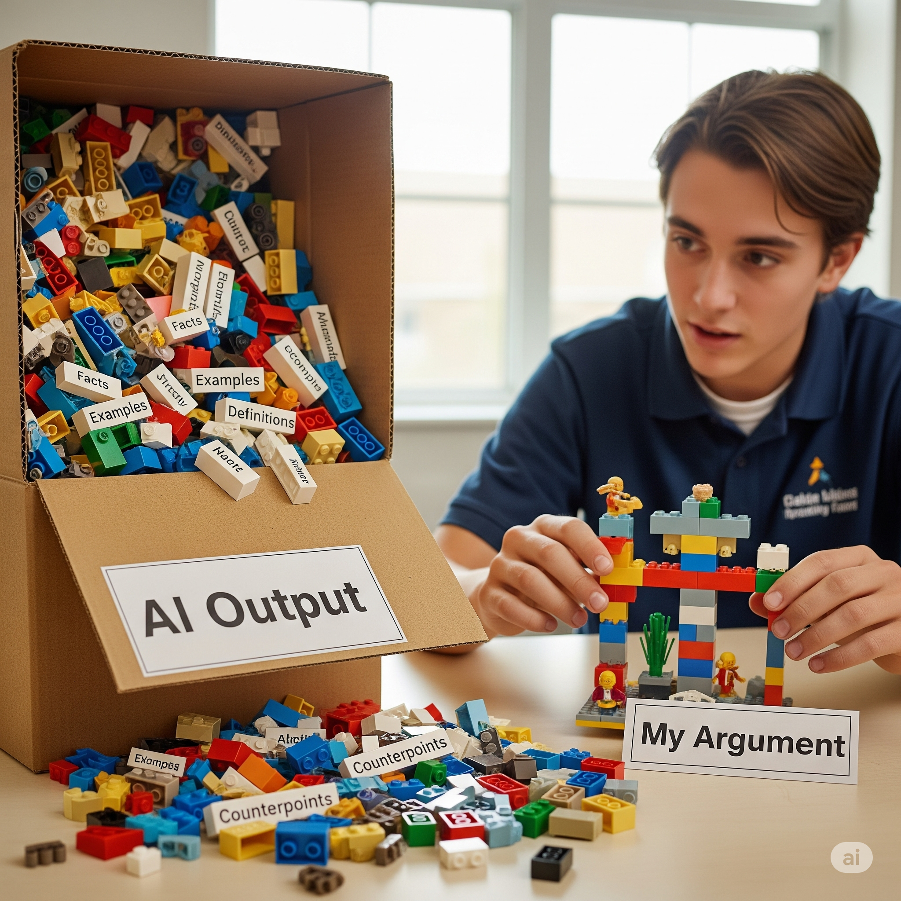
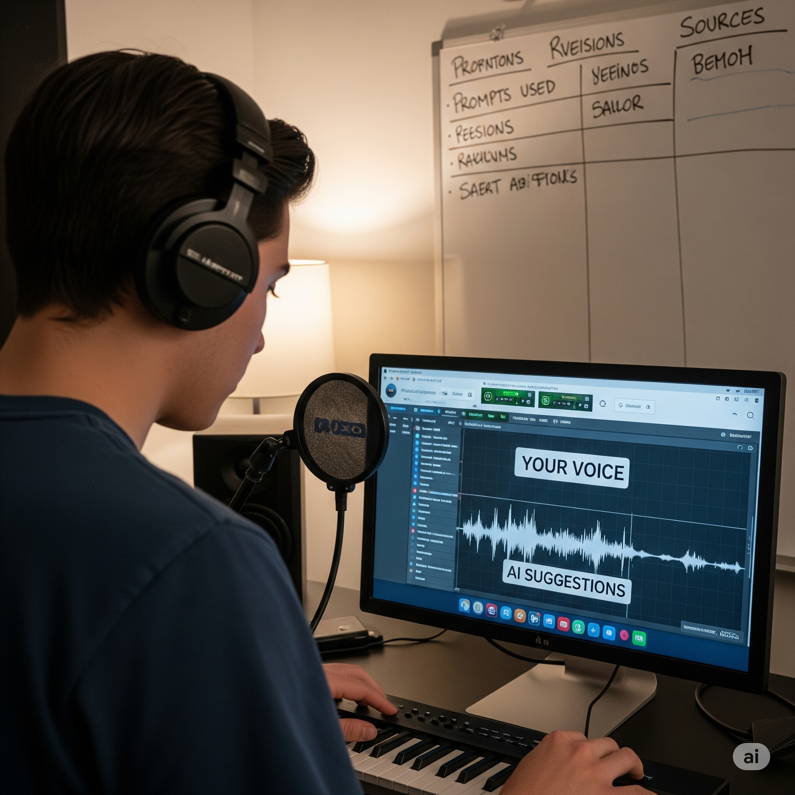

# AI and Originality: How to Use It Without Copying

## Learning Goals

By the end of this mini‑lesson, you should be able to:

* Explain the difference between using AI *as a tool* vs. letting it *be the author*.
* Transform raw AI output into writing that reflects your own ideas, structure, and voice.
* Show where ideas came from (attribution) and when text is yours, AI‑assisted, or quoted.

---

## AI as a Tool vs. Author: Responsible AI Use & Avoiding Plagiarism

<figure class="float-left-figure" style="width: 30%;">
    
    <figcaption class="figure-caption figure-caption-with-title">
      
      AI gives text 

       
      We should supply the thinking, structure, and credit
    </figcaption>
</figure>

AI can draft sentences fast, but speed is not authorship. Think of AI like a powerful thesaurus + autocomplete + research assistant rolled into one - it can surface phrasing, examples, or outlines, but it does not know your lived experience, classroom debates, or the argument you actually want to make. Plagiarism risk shows up when you copy‑paste AI text and submit it as if it reflects your own reasoning, or when you let AI paraphrase a source without checking meaning or crediting where ideas came from. 

A good rule: `if an idea, structure, or unusual phrasing came from somewhere else (a website, article, AI output), *mark that trail*`. Just like in math class you must `“show your work,”` and in writing you must show where key steps came from.

<!-- and right below this -->

How AI Generates Text (Responsible Use & Authorship)
When you prompt an AI like ChatGPT, the system isn’t flipping through a library or searching the web—it’s predicting, word by word, what should come next based on patterns it learned from enormous datasets (books, websites, articles, conversations). Under the hood, it uses a type of neural network called a `“transformer,”` which analyzes the relationships between words and phrases across billions of sentences during its training. This means the AI is essentially remixing fragments of knowledge, grammar, and style it has seen before; it doesn’t “think” or “know” in a human sense. The result is text that looks original but could, in places, closely align with phrasing from its training data. That’s why copying AI output verbatim can be risky—it’s not truly “authorless,” nor is it based on your unique purpose or experience. Giving credit and showing how you used AI is a bit like a citation for borrowed code in programming: it acknowledges that the organizational logic was system-generated, not your own creative leap.

---

## Remix & Transform: Making the Content Your Own

<figure class="float-left-figure" style="width: 30%;">
    
    <figcaption class="figure-caption figure-caption-with-title">
      
      Remix AI 
       
      building blocks into something only you would build
    </figcaption>
</figure>

Raw AI output is like a pile of Lego bricks someone else dumped on the table. You get to build the castle. Remixing means keeping what’s useful (a definition, a comparison, a list of points) but reorganizing, combining with your class notes, adding counter‑examples, trimming what’s off‑topic, and rewriting in a tone that sounds like you. 

Try this `“3× Transform”` test: 
(1) Restructure—change the order and emphasis based on your thesis; 
(2) Revoice—rewrite sentences in your natural style (short, direct, storytelling, formal—your call); 
(3) Reground—add one personal connection, classroom insight, data point, or citation that did *not* come from the AI. 

If after those steps your teacher can tell it’s *you* talking—and the draft would make less sense without your changes—you’ve remixed successfully.

<!-- and right below this -->

How AI “Builds” Responses (Remixing and Transforming)
Think of an AI’s output as assembled by a kind of statistical Lego master. Each time you ask it for a definition, argument, or analogy, the AI is doing rapid pattern-matching: it finds the most likely “pieces” (facts, explanations, transitions) according to its training but has no memory of any specific source, only probabilities. When you “remix”—by changing order, style, substance—you’re interrupting the autopilot of prediction and injecting precise human intent. This is crucial because AI has zero ability to judge context or accuracy the way a person does; it can blend true information with common misconceptions, or generate plausible but false references (“hallucinations”). Building your own “castle” from the AI’s Lego blocks means applying your knowledge, critical thinking, and voice—not just relying on its raw assembly. The rewrites, reordering, and added examples are real indicators of understanding—something the AI can’t do for you.

---

## Voice & Transparency: Let AI Coach, Not Ghostwrite

<figure class="float-left-figure" style="width: 30%;">
    
    <figcaption class="figure-caption figure-caption-with-title">
      
      
       
      AI can back you up—but the solo is yours
    </figcaption>
</figure>

The best writers use AI like athletes use video review: to spot blind spots, test variations, and get feedback—*not* to replace practice. Ask AI to critique clarity (“Where might a reader get confused?”), to generate alternative intros you can merge, or to challenge your claim with counterarguments you must answer. Keep a short “process note” at the top or bottom of your draft: what prompts you used, which parts were AI‑suggested, what you rewrote, and any sources the AI mentioned that you actually verified. This transparency protects you from unintentional plagiarism, helps teachers give better feedback, and builds trust in collaborative work. Over time, that note becomes a mirror showing how your voice grows stronger while AI plays a supporting role—like a backing track that lets your solo stand out.

<!-- and right below this -->

AI as Coach, Not Ghost (Voice & Transparency)
Modern AI models can mimic many writing styles or even debate both sides of an issue, but this flexibility is “surface-only.” They don’t have opinions, cannot cite real-time sources, and can’t track the development of your personal voice over multiple assignments. Transparency—documenting how you used AI and what you changed—actually aligns with how these systems are designed: every output is generated by tracing a specific chain of prompts, predictions, and training patterns. If you include a process note or annotation, you’re clarifying where the model’s help ended and your authorship began. In research and academia, this is becoming a new literacy skill: just as mathematicians line out steps in a proof, expert writers are beginning to share their “AI trail” to show collaborative, responsible knowledge-building. This habit doesn’t just protect you from plagiarism–it prepares you for the future of work, where human creativity and machine suggestions will coexist.

---

## Quick Comparison Guide

| If you…                                      | Risk                            | Better Practice                                    |
| -------------------------------------------- | ------------------------------- | -------------------------------------------------- |
| Paste AI text and submit unchanged           | Plagiarism / mis‑representation | Rewrite, cite, add your thinking                   |
| Let AI “paraphrase” a source you didn’t read | Inaccurate / hidden copying     | Read the source, summarize in your own words, cite |
| Hide that AI helped                          | Trust issues                    | Include a brief AI use statement                   |

---

## Thought Experiment (5‑Minute Discussion)

Imagine two students submit essays. Student A wrote everything alone but forgot to cite two sources. Student B used AI for the first draft, then rewrote fully, added personal analysis, and clearly stated: “AI helped me generate an outline; all final wording and sources verified by me.” Which student is being more academically honest? Why? What grading challenges does this create for teachers?

---

## Mini Prompt Bank for Students

Use these when working with an AI assistant:

* “Give me 5 angles on this topic; I’ll choose and write it myself.”
* “Highlight which sentences in your draft need fact checks.”
* “Rewrite this paragraph in a more conversational tone, but I will add my own examples.”
* “List possible sources I should read; don’t write the essay.”

---

## Interactive Instant Quiz

<!-- Question 1 -->_

<!-- Question 2 -->

<!-- Question 3 -->

