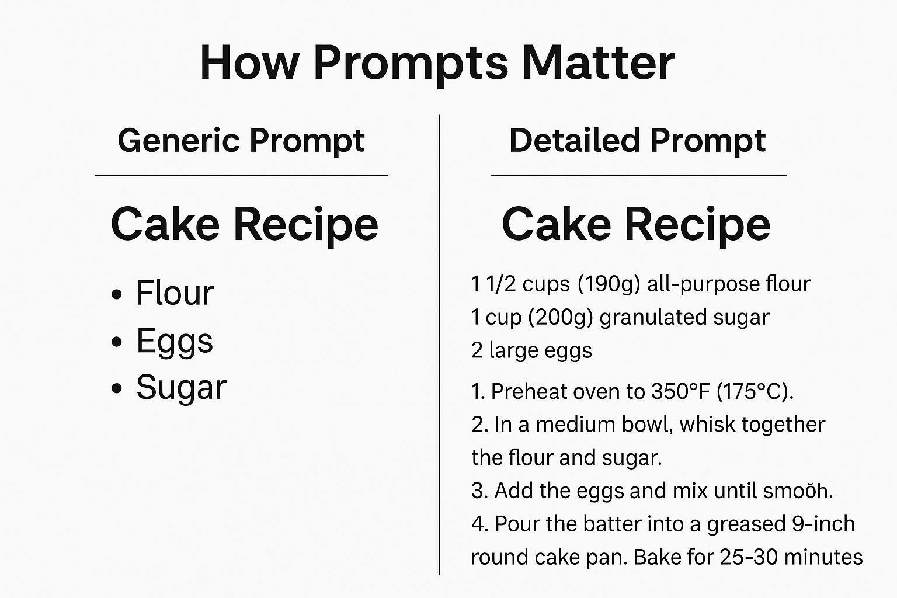
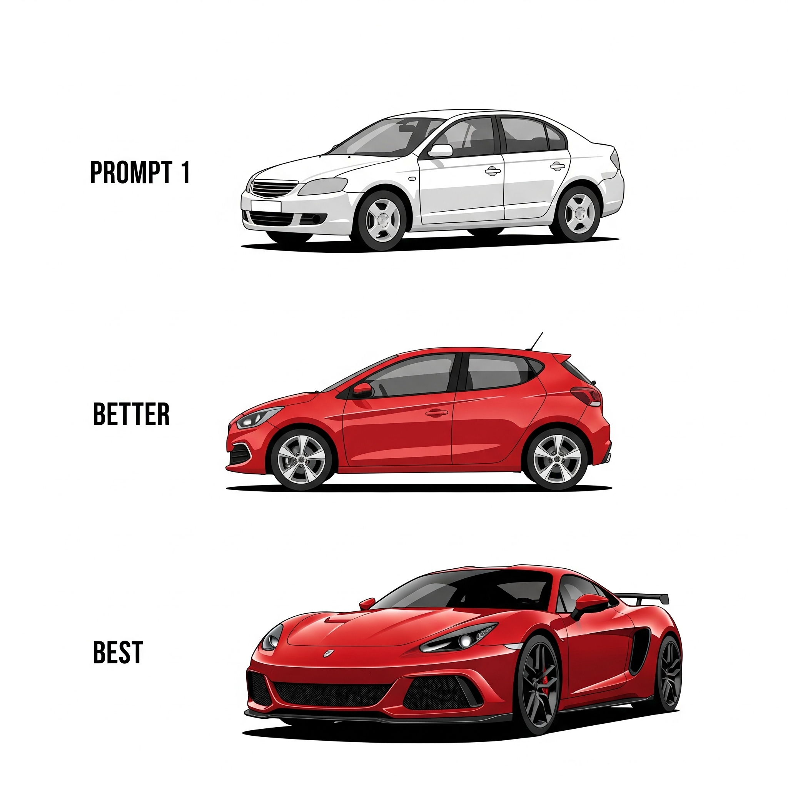
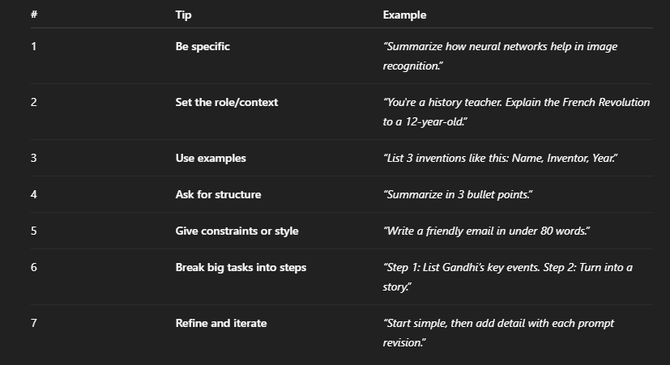

# Prompt Recipes: How to Get the AI to Do What You Want

## The Power of Specificity – Be the Director

When you talk to an AI, it’s not like waving a magic wand—it’s more like giving very clear instructions. If you just say, “Make a picture of a dog,” the AI has no idea what you’re imagining. You’ll probably get something plain or random. But if you describe exactly what you want—like `“a grumpy badger with tiny spectacles, drinking tea at a café, drawn like a page from a children's book”`—you take control. You're not just watching the AI work, in fact, *you're directing it*!

Being specific is the key to unlocking the AI’s true power. Think of it like ordering food: saying `“I want food”`could mean anything, but `“I want a large veggie pizza, extra cheese, thin crust”` gets you exactly what you want. 

## The Art of the Remix – Iteration and Experimentation

When you use AI, getting the perfect answer usually doesn’t happen on your first try. Just like working on a school project or learning to play a new game, it takes a bit of trial and error. You start with one prompt, see what the AI gives you, and then think, “Hmm, how can I make this better?” 

That’s where the real learning happens.

You might try adding more details, changing the tone, or telling the AI exactly what kind of style you want. Sometimes, it helps to say what you *don’t* want. It’s a bit like being a DJ—testing out different mixes until it sounds just right. The more you tweak your prompt, the better the AI understands you. And with each try, you get closer to the result you’re looking for.

#### Analogy (Specificity)

Comparing an AI prompt to a recipe for a chef. A vague recipe (`"make dessert"`) gets you anything, but a detailed one (`"bake chocolate chip cookies with extra dark chocolate and a pinch of sea salt"`) gets you exactly what you want.

**Constant iteration**: The idea and the message is simple. We need to keep experimenting constantly! It is like a video game player trying different button combos to unlock a special move. That's how we learn about LLMs.

#### An Example of Prompt Iteration

- **A Not-so-good Prompt:** `"Write a story about a superhero."` 
  (AI gives a generic story)
- **A Better Prompt**: `"Write a story about a teenage superhero who can control shadows, fighting a giant robot in a city at night."` (AI gives a better story, but maybe not quite right)
- **An Even Better Prompt**: `"Okay, that's better! Now, make sure the superhero's powers are a bit clumsy at first, and the robot is powered by old arcade games. Also, add a humorous sidekick who's always hungry."` (AI gives an even more refined story).

# Tips for Writing Better Prompts

Are you using this principles?

## Ask for Structure in Your Output

Better prompting means knowing that the way you ask shapes the way the AI answers. 

If you ask for a list, a summary, or a step-by-step explanation, the response will usually follow that same format. This makes the answer clearer and more useful. 

A good prompt gives the AI a clear path to follow—just like asking a clear question in class helps students give better answers. 

When your prompt is well-structured, the AI gives more helpful and organized responses.

#### Final Takeaway
 The more details you give, the better the AI can match your vision. So don’t just be the audience—be the director. Tell the AI what you see in your mind, and it will do its best to bring it to life.

## Interactive Activity

