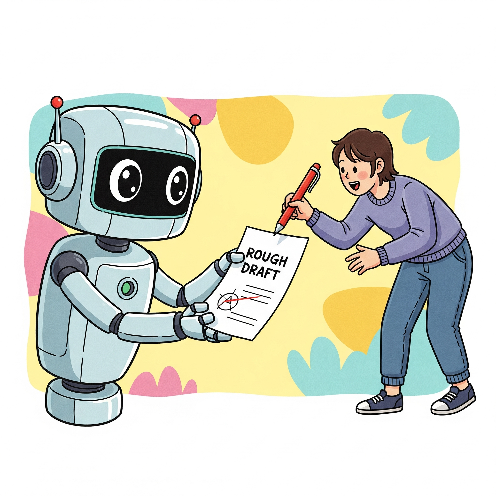
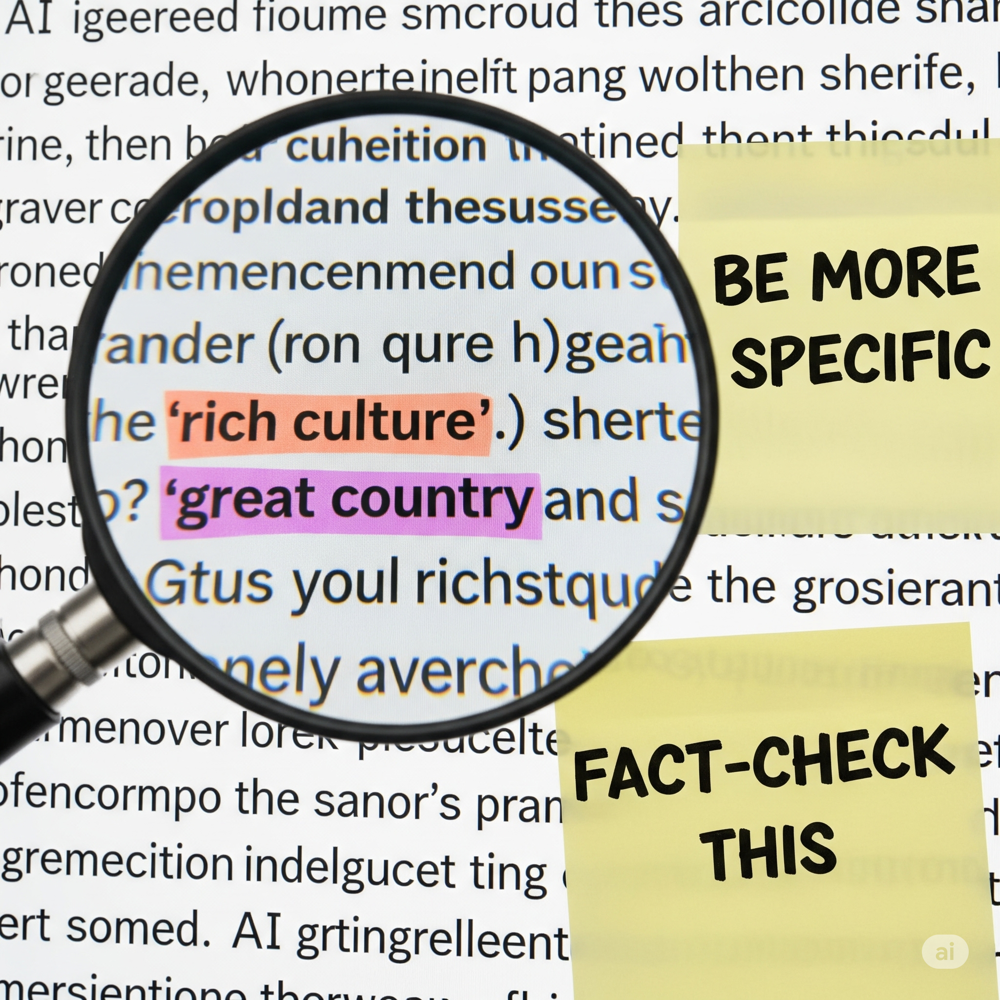
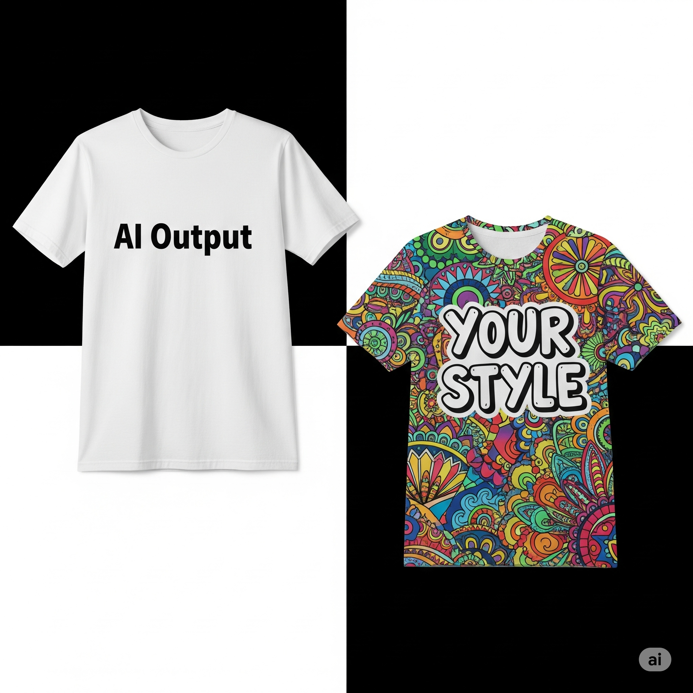

# Make It Better: Revising AI Output Like a Pro

## **AI Is a First Draft, Not the Final Word**

<figure class="float-left-figure" style="width: 30%;">
    
    <figcaption class="figure-caption figure-caption-with-title">
      Edit, edit, edit We humans have to edit and instruct and direct the AI output.
    </figcaption>
</figure>

AI-generated content often reads clean and confident, but that doesn’t mean it’s perfect. Models like GPT can create logical-sounding text that hides subtle mistakes or lacks depth. Think of the AI’s response as a *rough draft*: fast and helpful, but rarely ready for prime time. Your role is to act as the editor—polishing its language, checking for errors, and making sure it fits your style and purpose.

**Analogy:**
It’s like a baker handing you dough that’s been mixed but not yet baked. The ingredients are there, but you still need to shape it, add your spices, and put it in the oven.

Why AI Is a First Draft: How Language Models Generate Text
When you prompt an AI like GPT, it doesn’t “know” facts or “think” like a person—it’s predicting the next word based on patterns it learned from massive amounts of text. During training, the model processed billions of sentences from books, websites, and articles, learning how words and ideas tend to follow one another. When you ask it a question, it uses probability to guess the most likely next word, one token at a time. That’s why it can sound fluent and even insightful, but also why it sometimes makes mistakes or gives shallow answers—it’s not drawing from a database of verified facts, just from patterns in language.

---

## **Spotting Weak Spots and Hallucinations**

<figure class="float-left-figure" style="width: 30%;">
    
    <figcaption class="figure-caption figure-caption-with-title">
      AI = First Draft Find areas in the AI-generated output that can be improved by being more specific.
    </figcaption>
</figure>

Even when AI sounds right, it can be wrong. It may invent facts (“hallucinations”), oversimplify complex ideas, or offer vague and repetitive phrases. As the human in the loop, train yourself to look critically:

* Are the facts accurate?
* Does the tone fit your audience?
* Are there generic phrases that need replacing with specific details?

**Example:**
AI might say: *“India is a beautiful country with a rich culture.”* You could revise it to: *“India’s cultural diversity spans over 2,000 ethnic groups and 1,600 languages, making it one of the most multilingual nations on Earth.”*

Why AI Hallucinates: The Limits of Pattern Matching
AI hallucinations happen because the model isn’t retrieving facts from a source—it’s generating plausible-sounding text based on its training data. If it’s seen similar phrasing before, it might confidently invent a statistic or quote that sounds real but isn’t. This is especially common when the model is asked to be specific, but the training data didn’t include reliable details on that topic. Unlike a search engine, it doesn’t check the truth of what it says. That’s why human oversight is critical: you’re not just editing for style, you’re fact-checking a system that was never designed to guarantee accuracy.

---

## **Personalizing and Adding Your Voice**

<figure class="float-left-figure" style="width: 30%;">
    
    <figcaption class="figure-caption figure-caption-with-title">
      Iterate: With a little bit of work, you can make the AI output to match your personal style
    </figcaption>
</figure>

Raw AI output often lacks personality because it’s designed to sound neutral and “average.” To make it yours, rewrite sections with your own tone, humor, or perspective. Add anecdotes, opinions, or stylistic flourishes the AI can’t invent. This turns a generic paragraph into something that sounds like *you*.

**Analogy:**
Imagine AI handing you a plain white T-shirt. It’s functional, but you still need to dye it, print your design, and wear it your way.

Why AI Sounds Generic: Training on the “Average” Voice
During training, the AI is exposed to a wide range of writing styles—from academic papers to Reddit threads—but it’s optimized to produce responses that are broadly acceptable and inoffensive. That means it tends to default to a neutral, middle-of-the-road tone. It’s like averaging all the voices it’s seen into one. That’s why its output can feel bland or impersonal. When you rewrite it in your own voice, you’re doing something the model can’t: injecting personal experience, emotion, and creative risk-taking. You’re turning a statistical average into something truly human.

## Interactive Instant Quiz

<!-- Question 1 -->

<!-- Question 2 -->

<!-- Question 3 -->

