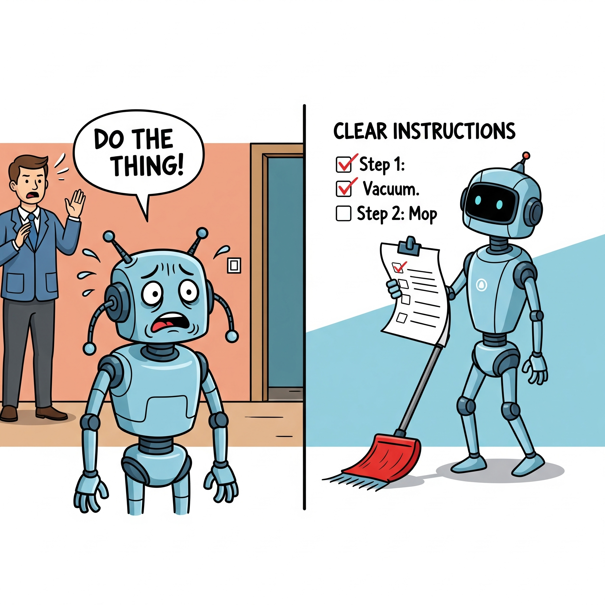
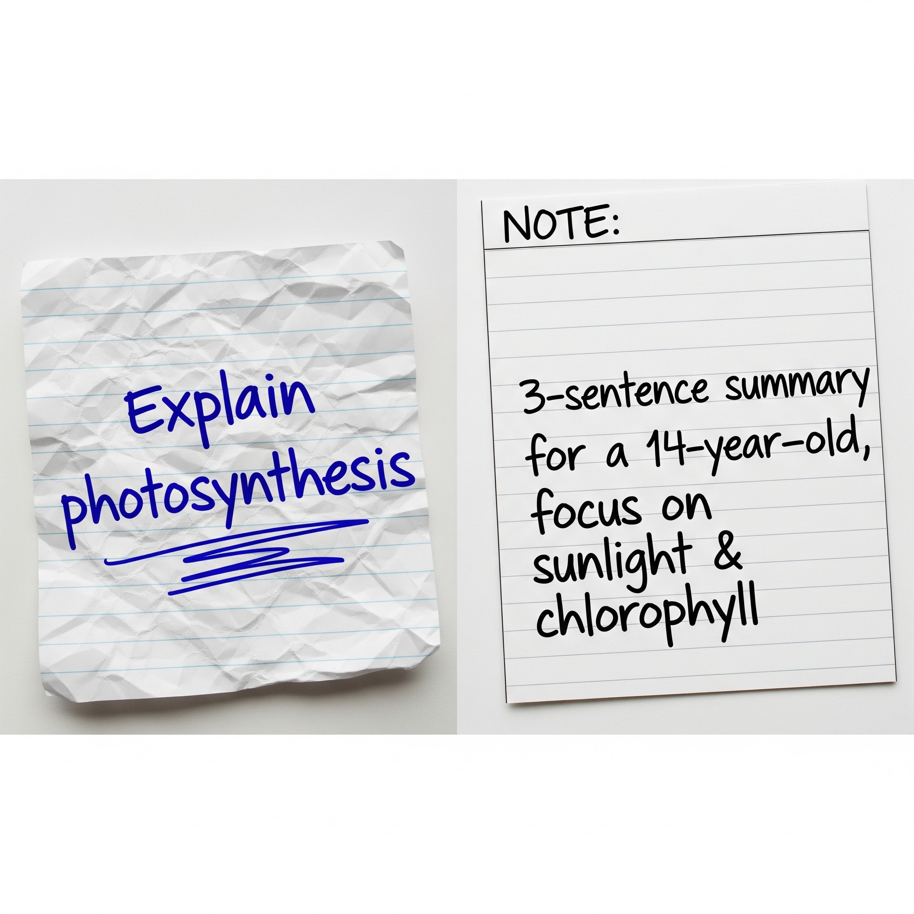

# Talk to AI Like a Teacher, Not a Search Engine

When you use AI, your words are its instructions. The clearer you are, the better it works. Learning to talk to AI is a skill—and it can help you get smarter, faster answers.

## AI Isn’t a Mind Reader—It’s a Pattern Matcher

When you ask an AI a vague question like “Tell me about India,” it doesn’t know what you’re really after. Are you asking about history? Geography? Food? It tries to guess based on patterns in its training data. But unlike a human teacher, it has no intuition about your intent. The result? Generic or scattered answers. If you want sharper responses, you need to “train” the AI in the moment with a clear, focused prompt.

Analogy:
It’s like programming a robot. Saying `“clean my house”` might lead it to vacuum randomly, but saying “vacuum the living room, then mop the kitchen floor”` gives it structure it can follow.`

Optional: How AI Really Works—A Peek Under the Hood

Pattern Matching Isn’t Magic—It’s Statistics at Scale

When you interact with an AI like this one, you’re using a tool built on machine learning models called neural networks. These models are trained on vast amounts of text—books, articles, websites—so they can recognize patterns in language. When you type a question, the AI doesn’t “think” or “understand” like a person. Instead, it predicts what words or sentences are most likely to come next, based on all those patterns it has seen before. This is why vague prompts lead to generic answers: the AI is just drawing from the most common patterns it has learned, not reading your mind.

---

## Good Prompts Are Like Good Lesson Plans

Think of a prompt as your `“lesson plan”` for the AI. The more context and structure you give, the better the output. Instead of `“Explain photosynthesis,”` try `“Explain photosynthesis in 3 sentences for a 14-year-old biology student, focusing on sunlight and chlorophyll.”` Notice how this sets clear boundaries: audience (age), format (3 sentences), and focus (sunlight and chlorophyll).

When you guide the AI with these details, it doesn’t waste time guessing—it gets straight to work.

Prompts Guide the Model’s Inner Workings

A well-structured prompt acts like a map for the AI’s internal processes. Technically, our prompt is converted into numbers (called embeddings) that the model can process. The AI then runs these numbers through many layers of mathematical functions, each layer detecting different features or relationships in your input. The clearer and more detailed our prompt, the more the model can “narrow down” its search for the best possible response. In practice, this means the AI is less likely to wander off-topic or make mistakes, because our instructions help it focus on the right patterns in its training data.

---

## Iterate and Refine: Teaching the AI as You Go

Even with a good prompt, the first reply might not be perfect. That’s normal. Treat AI like a student who’s trying to learn what you want. Give feedback or refine your prompt: “That’s too technical. Can you make it sound like a story?” or “Add a fun fact to each bullet point.” This back-and-forth is how you “teach” the AI to deliver results closer to your vision.

Analogy:
It’s like adjusting a recipe. The first cake might be too dry, but with small tweaks (more milk, less time in the oven), the next one comes out perfect.

Iteration Is Like Fine-Tuning—But in Real Time

Behind every answer, the AI is adjusting its predictions based on your feedback. While the core model doesn’t learn from each individual conversation (for privacy and safety reasons), your refinements act as “real-time tuning.” Each time you clarify or redirect, you’re essentially providing a new prompt that helps the model recalculate its best response. In professional AI development, this process is mirrored by “fine-tuning,” where engineers retrain models on specific examples to improve performance. Your back-and-forth with the AI is a mini version of this, helping you get closer to the answer you want by continuously shaping the model’s output.

---

## Interactive Instant Quiz

<!-- Question 1 -->

<!-- Question 2 -->

<!-- Question 3 -->

