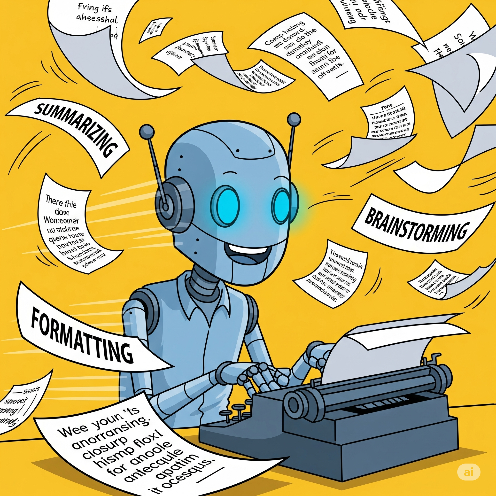
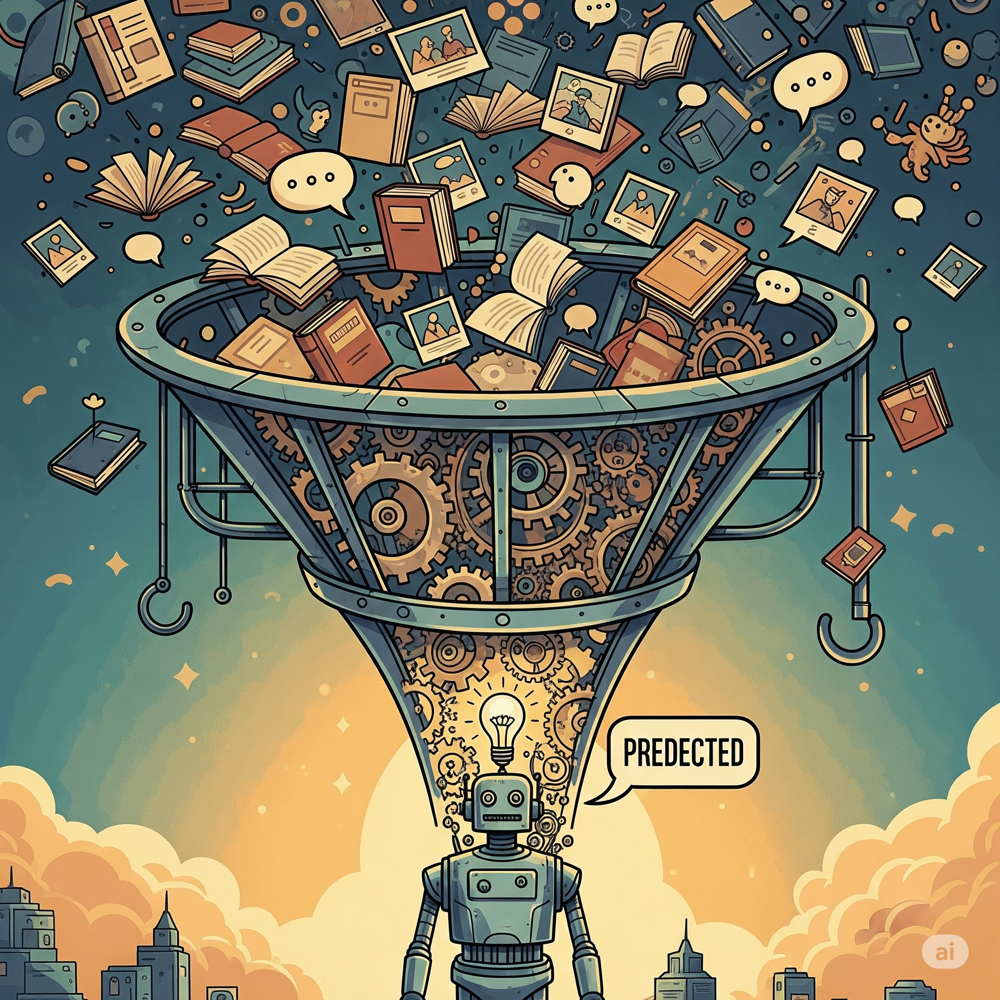
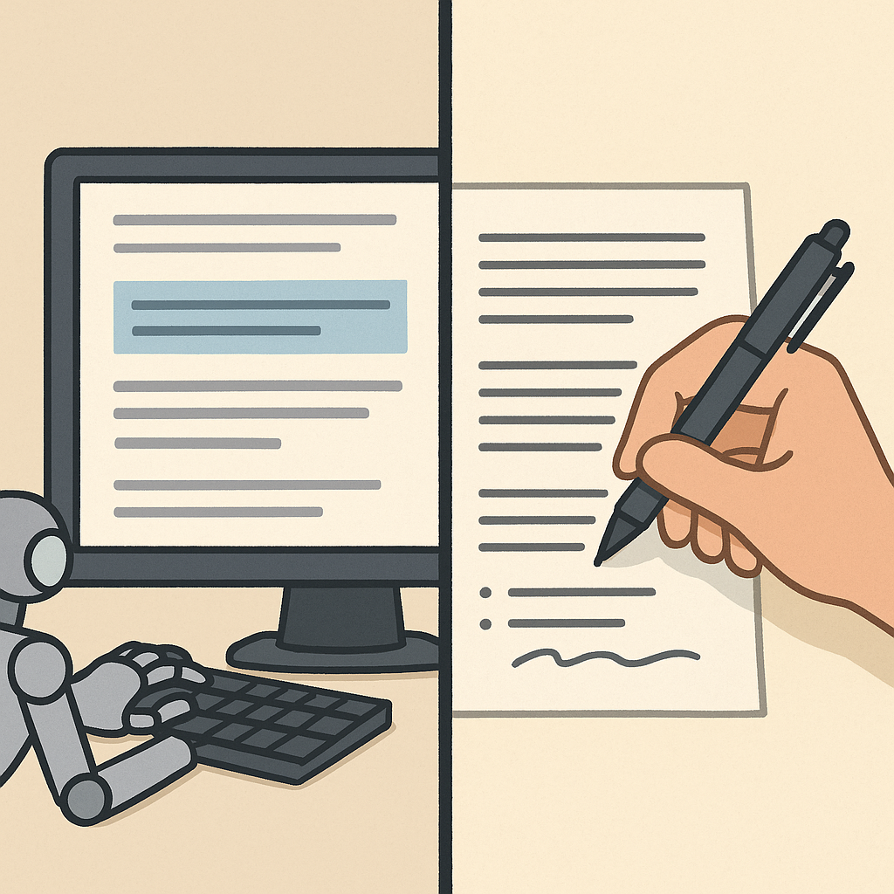

# When Not to Use AI

AI is a powerful helper, but it’s not always the best choice. Knowing when to rely on it—and when to think for yourself—is the key to using AI wisely.

---

## 🏃‍♀️ What AI Does Well: Speed, Scale, and Structure

AI tools shine when you need to handle huge amounts of information quickly. They’re great at summarizing long articles, reformatting notes, or brainstorming multiple ideas in seconds. This happens because AI is trained on vast datasets and can spot patterns to organize information efficiently. But remember—it’s mechanical strength, not creative genius.

**Analogy:**  
AI is like a calculator. It can crunch numbers at lightning speed, but it doesn’t understand why you’re adding them up.

Why AI Struggles With Judgment and Nuance

Despite their power, today’s AIs don’t have real understanding or personal experience. Their “judgment” is just statistical pattern-matching—choosing responses that fit the data they’ve seen most often. They don’t have beliefs, values, or emotions, so they can’t truly empathize or give advice tailored to your unique life. When you ask for personal or ethical guidance, the AI samples from what people have written on those topics, but it can’t weigh your feelings or history. This is why AI sometimes gives bland, generic, or even odd advice in situations that need real human insight.

---

## 🤔 Where AI Falls Short: Judgment and Understanding

AI struggles with tasks that require deep understanding, personal judgment, or emotional nuance. It can’t share life experiences, form genuine opinions, or understand context like you can. For example, asking *“What’s the best career for me?”* gives generic advice, because AI doesn’t know your values, dreams, or history. Its “opinions” are just echoes of patterns from its training data.

**Analogy:**  
It’s like asking your GPS where you should go in life. It can show you routes, but it can’t choose your destination.

How Human-AI Collaboration Works Technically

When you work with AI—say, using it to draft an essay outline and then adding your own ideas—you’re combining two strengths. The AI quickly generates structured content by predicting likely sequences of words, but it doesn’t know what’s “good” or “meaningful” to you. Your edits, feedback, and creativity act as a filter, shaping the raw material into something original and personal. In fact, this back-and-forth is similar to how AI models are improved: developers use human feedback to fine-tune models, making them more helpful over time. The best results come when you use AI’s speed and structure, then add your own judgment and voice.

---

## 🤝 The Sweet Spot: Humans and AI Together

   *Caption: “Best results = collaboration.”*

The best results happen when humans and AI collaborate. You bring goals, judgment, and creativity; AI brings speed and pattern recognition. For instance, use AI to draft an essay outline, then add your own insights and style. Recognizing this balance helps you avoid over-relying on AI—or underusing it.

**Analogy:**  
It’s like a chef using a food processor. It saves time chopping, but the chef still creates the recipe.

Optional: How AI Really Works—Behind the Scenes

Why AI Is So Fast and Structured
   
Under the hood, AI tools like chatbots and summarizers run on neural networks—complex mathematical systems inspired by the brain, but far simpler. These networks are trained on massive datasets, sometimes containing billions of words, so they can rapidly spot patterns in text. When you ask AI to summarize an article or brainstorm ideas, it doesn’t “read” in the human sense. Instead, it breaks your request into tokens, runs them through layers of calculations, and predicts the most likely useful output based on what it’s seen before. That’s why AI can process huge amounts of information in seconds, but it’s just following learned patterns, not inventing anything new.

---

## 💡 Interactive Activity: AI or Human? Or Both?

Sort the following tasks into three categories: **Good for AI**, **Better for Humans**, and **Both Together**.

| Task                                    | Good for AI | Better for Humans | Both Together |
|-----------------------------------------|-------------|--------------------|---------------|
| Summarize a 20-page report              | ✅           |                    |               |
| Decide which college to attend          |             | ✅                  |               |
| Draft a party invitation                |             |                    | ✅             |
| Comfort a friend after a bad day        |             | ✅                  |               |
| Generate ideas for a science project    | ✅           |                    |               |
| Write a heartfelt apology               |             | ✅                  | ✅             |

---

## 🌱 Final Thought

AI is a powerful assistant, not a replacement for human thinking. Use it where it excels, but save the decisions, values, and emotions for yourself. That’s the real sweet spot of using AI effectively.

## Interactive Instant Quiz

<!-- Question 1 -->

<!-- Question 2 -->

<!-- Question 3 -->

