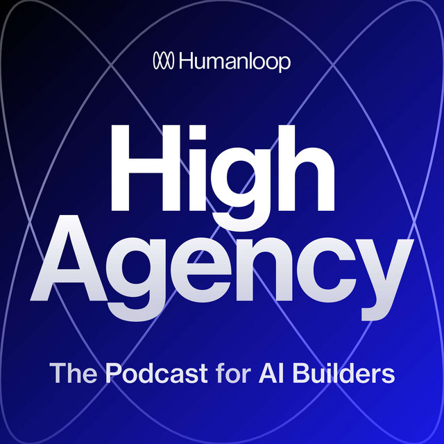
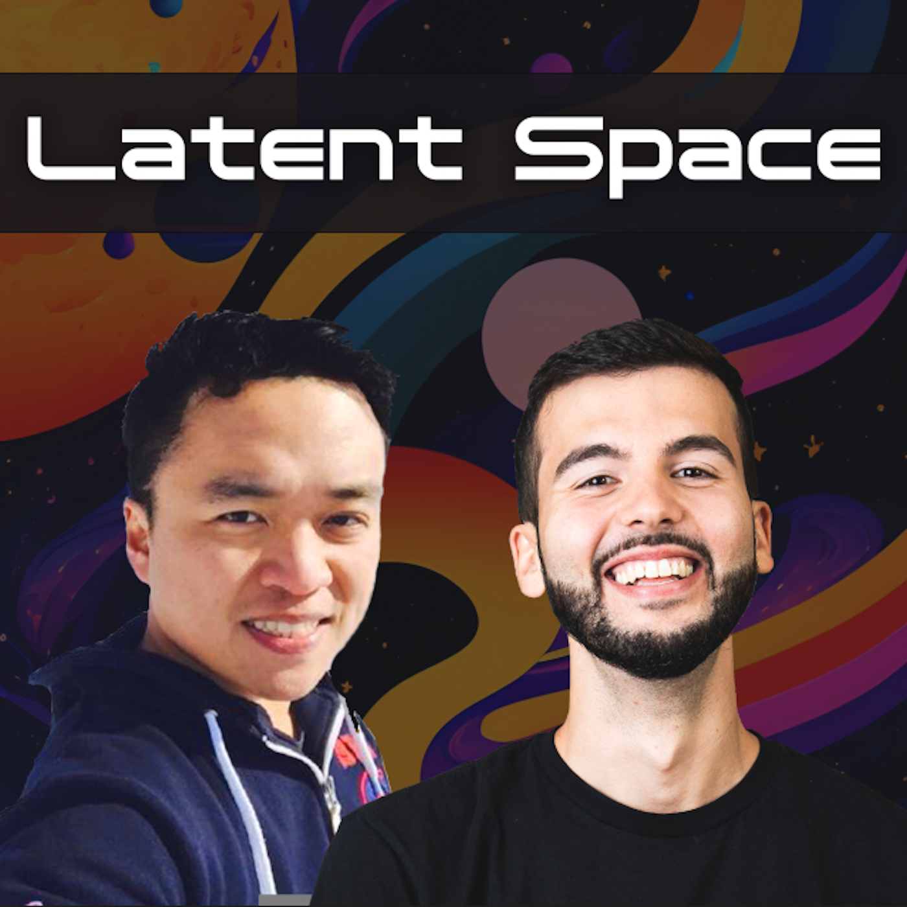
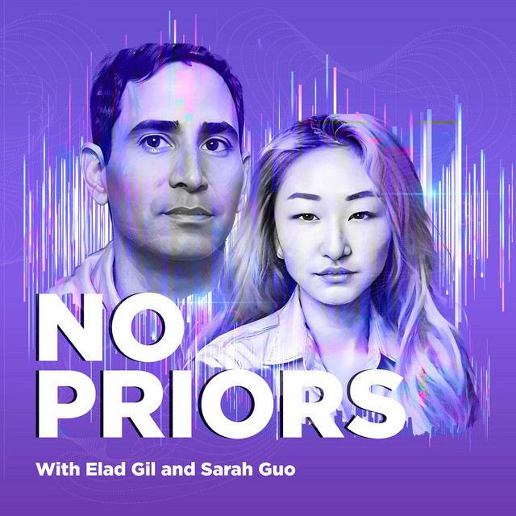
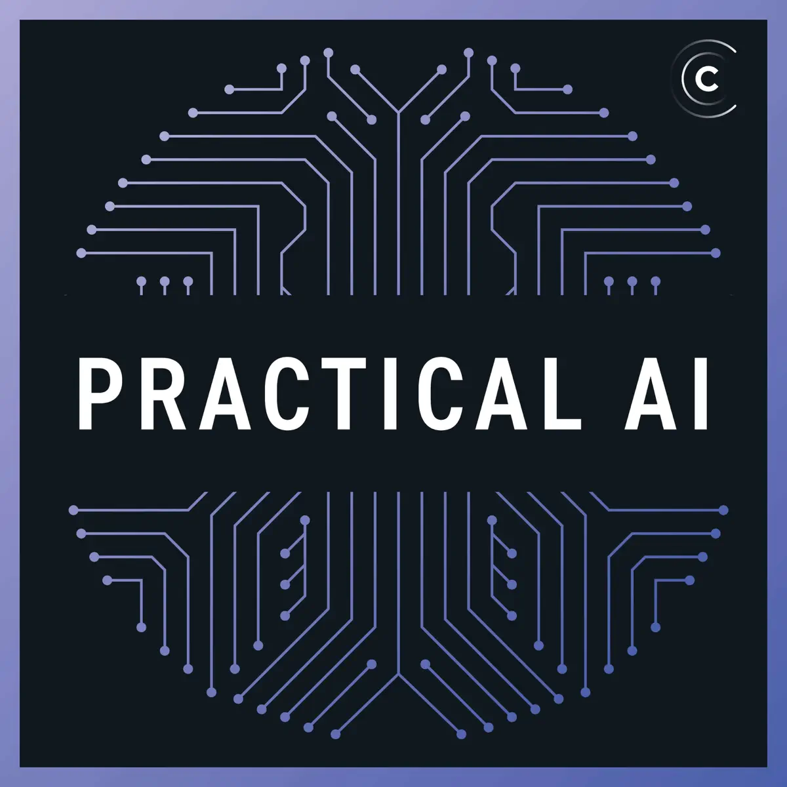
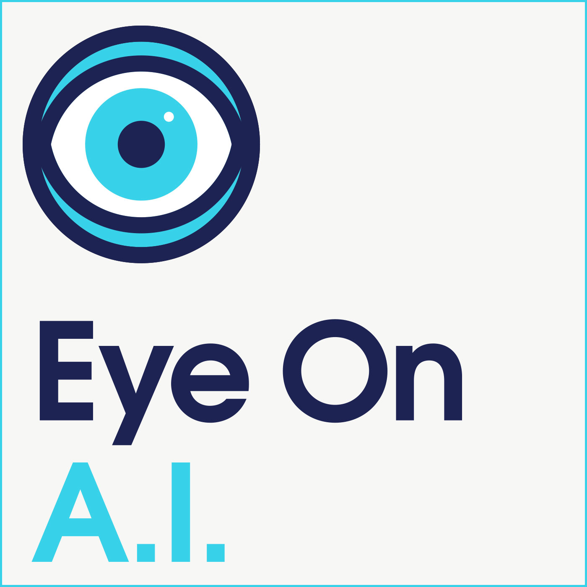

# Gen AI Podcasts

## Top AI & Generative AI Podcasts (Updated August 2025)

<figure class="float-left-figure" style="width: 30%;">
    
    <figcaption class="figure-caption figure-caption-with-title">
      High Agency
    </figcaption>
</figure>
High Agency

A practical podcast for AI builders, creators, and those leveraging generative AI. Hosted by Raza Habib (CEO, Humanloop), it features interviews with leaders in the AI industry and covers how to reliably build with Large Language Models.

<a href="https://podcasts.apple.com/us/podcast/high-agency/id1672708175" target="_blank">Listen on Apple Podcasts</a> |
<a href="https://open.spotify.com/show/18SdEMUQOhyB4fMwWHKnVc" target="_blank">Listen on Spotify</a>

<figure class="float-left-figure" style="width: 30%;">
    
    <figcaption class="figure-caption figure-caption-with-title">
      Latent Space: The AI Engineer Podcast
    </figcaption>
</figure>
Latent Space: The AI Engineer Podcast

Deep technical dives, explanations, and interviews on AI engineering with innovators from OpenAI, MosaicML, and more. Excellent for those wanting to understand the nuts and bolts of generative AI and LLMs.

<a href="https://podcasts.apple.com/us/podcast/latent-space-the-ai-engineer-podcast/id1647864111" target="_blank">Listen on Apple Podcasts</a> |
<a href="https://open.spotify.com/show/4M1zutwri6dhlYTOPZQOq5" target="_blank">Listen on Spotify</a>

<figure class="float-left-figure" style="width: 30%;">
    
    <figcaption class="figure-caption figure-caption-with-title">
      No Priors
    </figcaption>
</figure>

No Priors

Hosted by Sarah Guo and Elad Gil, this podcast discusses the latest trends, research, and interviews with prominent voices in generative AI, AGI, and the impact of AI on society and business.

<a href="https://podcasts.apple.com/us/podcast/no-priors-artificial-intelligence-ai-machine-learning/id1648360039" target="_blank">Listen on Apple Podcasts</a> |
<a href="https://open.spotify.com/show/0C4wO54h5ySrImQtevGXpN" target="_blank">Listen on Spotify</a>

<figure class="float-left-figure" style="width: 30%;">
    
    <figcaption class="figure-caption figure-caption-with-title">
      The AI Podcast (NVIDIA)
    </figcaption>
</figure>
The AI Podcast (NVIDIA)

One of the longest-running podcasts, featuring stories from all walks of AI—from scientists and artists to business leaders using AI in unique, world-changing ways.

<a href="https://ai-podcast.nvidia.com" target="_blank">Listen online</a> |
<a href="https://podcasts.apple.com/us/podcast/the-ai-podcast/id1173576032" target="_blank">Listen on Apple Podcasts</a>

<figure class="float-left-figure" style="width: 30%;">
    
    <figcaption class="figure-caption figure-caption-with-title">
      Practical AI
    </figcaption>
</figure>

An accessible show aiming to make AI practical, productive, and accessible to everyone, hosted by Daniel Whitenack and Chris Benson. Great for beginners and intermediates wanting real-world AI context.

<a href="https://changelog.com/practicalai" target="_blank">Listen online</a> |
<a href="https://podcasts.apple.com/us/podcast/practical-ai/id1420716055" target="_blank">Listen on Apple Podcasts</a>

<figure class="float-left-figure" style="width: 30%;">
    
    <figcaption class="figure-caption figure-caption-with-title">
      Eye on AI
    </figcaption>
</figure>

Award-winning journalist Craig S. Smith interviews those shaping the field, exploring advances, ethics, and how AI impacts everything from science to culture.

<a href="https://podcasts.apple.com/us/podcast/eye-on-ai/id1439825219" target="_blank">Listen on Apple Podcasts</a> |
<a href="https://eye-on-ai.simplecast.com/" target="_blank">Listen online</a>

<figure class="float-left-figure" style="width: 30%;">
    
    <figcaption class="figure-caption figure-caption-with-title">
      TWIML AI Podcast (This Week in Machine Learning & AI)
    </figcaption>
</figure>
Sam Charrington’s excellent podcast covers transformative research and real-world applications of AI, featuring some of the field’s most respected voices.

<a href="https://podcasts.apple.com/us/podcast/the-twiml-ai-podcast-formerly-this-week-in-machine/id1203874475" target="_blank">Listen on Apple Podcasts</a> |
<a href="https://twimlai.com/shows/twimlai/" target="_blank">Listen online</a>

<figure class="float-left-figure" style="width: 30%;">
    
    <figcaption class="figure-caption figure-caption-with-title">
      Generative AI 101
    </figcaption>
</figure>

A newer podcast (2025) dedicated specifically to generative AI, with accessible breakdowns of key concepts and emerging applications.

<a href="https://podcasts.apple.com/us/podcast/generative-ai-101/id1750985562" target="_blank">Listen on Apple Podcasts</a>

<figure class="float-left-figure" style="width: 30%;">
    
    <figcaption class="figure-caption figure-caption-with-title">
      AI Today
    </figcaption>
</figure>
A no-hype, real-world focused show by Cognilytica, featuring expert interviews on new applications, ethics, and trends in AI and generative AI.

<a href="https://podcasts.apple.com/us/podcast/ai-today-podcast-artificial-intelligence-insights-ethics/id1268048243" target="_blank">Listen on Apple Podcasts</a>

<figure class="float-left-figure" style="width: 30%;">
    
    <figcaption class="figure-caption figure-caption-with-title">
      ChatEDU: The AI in Education Podcast
    </figcaption>
</figure>

Specifically for educators and students, this show discusses AI’s role in education and how technology is changing the classroom experience.

<a href="https://podcasts.apple.com/us/podcast/chatedu-the-ai-in-education-podcast/id1728870840" target="_blank">Listen on Apple Podcasts</a>

<figure class="float-left-figure" style="width: 30%;">
    
    <figcaption class="figure-caption figure-caption-with-title">
      AI in Education Podcast
    </figcaption>
</figure>
Focused on practical insights, risks, and stories from the classroom for K-12 and higher education communities.

<a href="https://podcasts.apple.com/us/podcast/ai-in-education-podcast/id1481311877" target="_blank">Listen on Apple Podcasts</a> |
<a href="https://aipodcast.education" target="_blank">Listen online</a>

