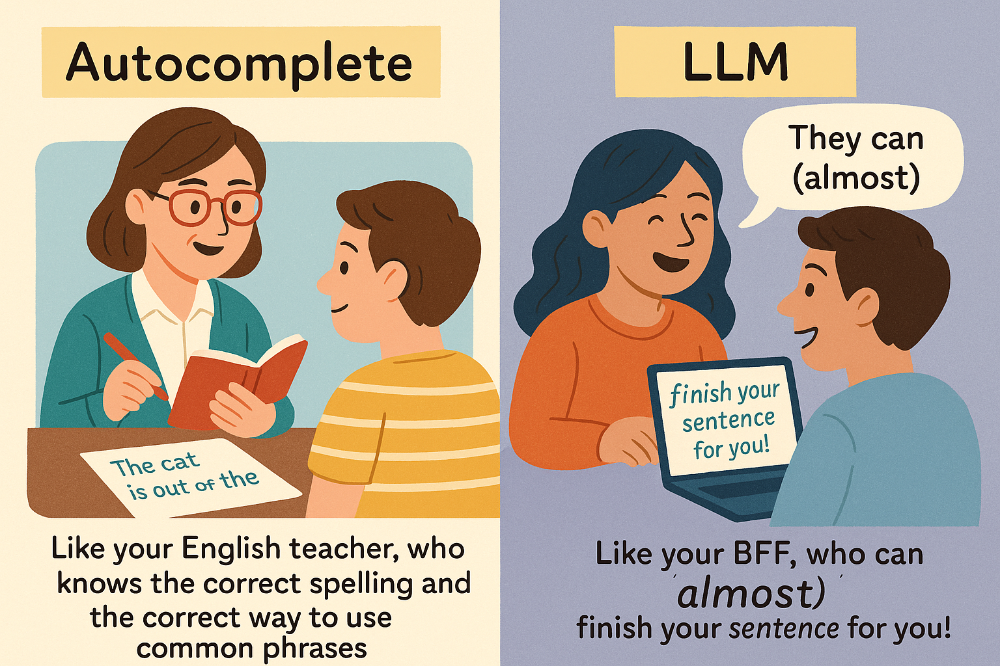

# From SpellCheck to AutoComplete to LLMs

How did these "generative" models get so good? These "Generative AI" tools (ChatGPT, Claude, LLama etc.) seem to appeared magically. But how did that really happen? It might help to start with the humble spell checkers from four decades ago.

Autocompletion has been around for nearly 2 decades now, so we are no longer surprised by it.
Example:
- When you type "recieve," the computer underlines it in red and suggests "Did you mean 'receive
- "I hope you are," and the computer immediately comes up "having a great day."
These are the _most logical_ and most common completions.

 <h3>Bringing in some "Context"</h3>

But there are times when we need a different word or phrase. That will depend on the *context*.

Thank you for your ——————. 

[ *Help, Time, Consideration* ] are all good candidates. What a model chooses will depend on the context that came before that sentence.

### An LLM Using a bigger Context

Let's say we want to complete this sentence: 

**"I'm sorry I couldn't submit my homework on time because ________"**
    
- A modern LLM might suggest a completion such as:
    
    - "I was feeling unwell and had to visit the doctor. I will submit it as soon as possible."
        
    - "I had some technical issues with my computer and couldn't finish the assignment."

Or it could take a completely different tack:

    - "Is it possible to get an extension? Thank you for your understanding."

In this last case, the LLM "retracted" a few words, and comes back with an entirely new sentence. But notice that it has fully understood the _intent_.

## Why Context matters

Let's take a common phrase. If you give 

    "Peanut butter and ________ " 

A regular autocomplete will always suggest "*jelly*." 

But let's say that someone specifies that they dislike jelly, and ask for alternatives. An LLM understands this "context" and might suggest:

    Peanut butter and sugar
    
or

    Peanut butter and honey

or 
    
    Peanut butter and marmalade
    
Notice that in this case, the LLM has figured out that something sweet (but not Jelly) is what fits here.

## Analogy

I find analogies to be helpful: 

Autocomplete is like your English teacher who knows the correct spelling, and the correct way to use common phrases.

But an LLM is like your BFF -- they know you so well and have had so many conversations with you that they can (almost) finish your sentence for you!

## A Helpful Timeline leading up to today's LLMs
- (1980s) There was a small dictionary file stored in each PC. It would compare words against it and mark the ones it didn't recognize. Exact matches only
- Once flip phones started showing up (aka "button" phones), you had to use the number keys to get letters. (Press 555 to get L.) Since this was very cumbersome, the screen would suggest 3 most likely words, based on what you had already typed - rudimentary predictive text
- Elementary "spell check" evolved into "autocorrect." and then "auto completion" It used NLP ideas (word frequencies, usage, context) to suggest corrections and completions.
- Software used for writing and notes (MS Word, Google Docs) started to look at "context" and "user intent" to suggest entire rephrasing of a set of words. (What are you _really_ trying to say?!)
- LLM's started showing up from around 2012-2015. Initially, people referred to these as "next word prediction" algorithms. These LLM's were fed billions of sentences to "learn from"
- Ideas like "attention" and "Transformers" (2017) made these LLMs extremely powerful.
They now seem to magically generate text!

